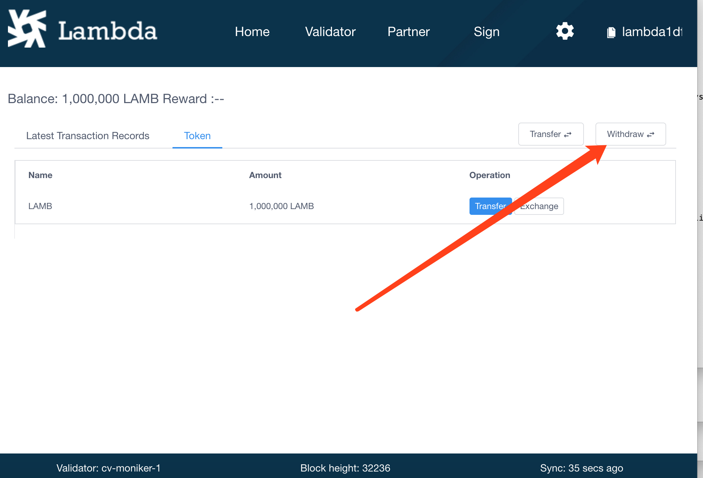

# Lambda Wallet Wallet Instructions
Version 0.3.13

A wallet supports the creation and management of multiple accounts in Chinese and English.


Download ：[https://github.com/LambdaIM/launch/releases/tag/Wallet0.3.13](https://github.com/LambdaIM/launch/releases/tag/Wallet0.3.13)


* [Switch-Language](#Switch-Language)
* [Create-Account](#Create-Account)
* [Use-Mnemonic-Import-Account-Into-Lambda-Program](#Use-Mnemonic-Import-Account-Into-Lambda-Program)
* [Signatures&Add-address-To-Pledge-System](#Signatures-And-Add-address-To-Pledge-System)
* [Import-Account](#Import-Account)
* [Home-Page-Description](#Home-Page-Description)
* [Transfer](#Transfer)
* [Export-Account-Profile](#Export-Account-Profile)
* [Change-Validator-Node-IP](#Change-Validator-Node-IP)
* [Exchange-LAMB-For-TBB](#Exchange-LAMB-For-TBB)
* [View-Validator-Info-And-Pledges](#View-Validator-Info-And-Pledges)
* [View-Partner-Info-And-Pledges](#View-Partner-Info-And-Pledges)
* [Redelegate](#Redelegate)
* [Cancel-Pledge](#Cancel-Pledge)
* [Withdraw-Rewards](#Withdraw-Rewards)
* [Withdraw-Validator-Profit](#Withdraw-Validator-Profit)
* [Assets View&Trading](#Assets-View-And-Trading)
* [Proposal Deposit&Vote](#Proposal-Deposit-And-Vote)
 
## Switch-Language


## Create-Account
Click Create Wallet button to go to create wallet page.

Enter the wallet name, password, confirm the wallet password, and click the Create button to enter the mnemonic page.


Please keep the mnemonic in order to restore the wallet later. It is best to record the mnemonic on the paper. The mnemonic can also be imported into the validator node program.

Click Next Step button to go to the next page. 


On the page that confirms the mnemonic, click the word on the page in the order of the mnemonics just shown.


After click the page shows as follows: 


Click Export Keystore File to back up your wallet.


Import the wallet again via lambda**********.keyinfo.

Create an account with your wallet completed here.


## Use-Mnemonic-Import-Account-Into-Lambda-Program

After creating the account, save the Mnemonic Words, use Mnemonic Words can import account into the lambda validator node.

Call the command line with lambdacli.

```bash
./lambdacli keys add [name] --recover
```

Enter the password twice according to the prompt.

```bash
Enter a passphrase to encrypt your key to disk:
Repeat the passphrase:
```


If the address of the output account is consistent with the wallet, the import is successful.

**tips**
Please note the mnemonic words showed in picture is just an example. 

## Signatures-And-Add-address-To-Pledge-System

input some word, and then copy the signature data to the Pledge System(https://validator.lambdastorage.com/#/)


Click to add the address in the address list page of Pledge System


## Import-Account

Click import wallet in the home page to enter the page for import accounts.


   

Click on Choose Wallet Files to select the backup file for your account.

The backup file is suffixed with keyinfo. For example, the configuration file created by the wallet is lambda.keyinfo.

Enter password when creating the wallet, then enter the name of the new wallet, and click import to import the wallet.

   


According to the mnemonic word import account, fill in the mnemonic word and set the password.


## Home-Page-Description
Newly created account with a balance of 0 and no transaction history

  

At the top is the navigation menu, click the Settings button to enter the settings page, click on the account address to copy it.

At the bottom is the information of the Validator node the wallet connected, including the public key address of the node, the height of the block, and the latest synchronized time of the block.

When account has a transaction record shows as follows


## Transfer
Click the Transfer button on the home page to open the Transfer dialog box and fill in the To address and amount.


Click Next to preview the transaction information, you can modify the gas 

click OK. The dialog box for entering the wallet password is displayed, enter the wallet password.


Click Submit, wait for 10s or so to complete the transfer, the transfer success is as follows


Click View Detail to view transfer details


## Export-Account-Profile

Click Keystore File Backup on the settings page to view the account backup file.


## Change-Validator-Node-IP
Click Switch Validator on the settings page to go to the page to view the Validator information.


Change the Validator IP in the input box, click Submit, and the message is as follows:


## Exchange-LAMB-For-TBB

TBB can be used for pledge


## View-Validator-Info-And-Pledges

First column is My Pledge List.
Second column is Validator List.

Click to Validator List


Click to view the validator node details


Click on the pledge button to pledge


## View-Partner-Info-And-Pledges
First column is My Pledge List.
Second column is Partner List.


Click the Partner List to view all the partner information.


Click to view partner details


Click on the pledge button to pledge


## Redelegate
Click on the Redelegate button on the details page of the node

Click to open the Redelegate window

Fill in the number of TBB  that need to be re-pledged and select a new node.

(If we want to redelegate all tbbs, we may fail. It is suggested that the total amount of pledge - 0.1 TBB is easier to be redelegated successfully.)


## Cancel-Pledge
Click the Cancel pledge button on the node's details page.

Click to open the cancel pledge window

Fill in the number of tbbs that need to be cancel.

(If you want to cancel all tbb, it may fail, it is recommended that the total amount of pledge -0.1 tbb to cancel pledge is easier to succeed)


## Withdraw-Rewards




## Withdraw-Validator-Profit
On the home page, click on the Withdraw Validator Profit in the Withdraw Rewards menu.


You can open a window to withdraw the benefits of the node.


## Assets-View-And-Trading

Click on the asset label on the front page of your wallet to see all assets in your current account.

Click on the trade button to open the window for trading assets.


## Proposal-Deposit-And-Vote
Click on the proposal in the navigation menu at the top to enter the proposal list page.

Click on the text description section of the proposal to enter the proposal details page.


When the status of the proposal is DepositPeriod, the proposal can be deposited with lambs.
Click the deposit button to open the deposit dialog box

When the deposit meets the requirement, the proposal will enter the VotingPeriod and click the voting button to open the voting dialog box.


Voting may choose to Yes, No, No with Veto or Abstain.  
If the first vote is incorrect, it doesn't matter that the second vote will cover the result of the first.  
The weight of voting is equal to the amount of pledge, which is valid in both node pledge and partner pledge.  
If there is no pledge, the voting is invalid.  


