# Lambda钱包使用说明
版本 0.4.18 

一个钱包支持创建和管理多个账户，支持语言有中文和英文。


下载地址 ：[https://github.com/LambdaIM/launch/releases/tag/Wallet0.4.18](https://github.com/LambdaIM/launch/releases/tag/Wallet0.4.18)


* [创建账号](#创建账号)
* [助记词导入到节点的程序包](#助记词导入到节点的程序包)
* [导入账号](#导入账号)
* [钱包首页说明](#钱包首页说明)
* [领取测试网测试币](#领取测试网测试币)
* [转账](#转账)
* [导出账号配置文件](#导出账号配置文件)
* [更换钱包链接的Validator节点](#更换钱包链接的Validator节点)
* [LAMB兑换TBB](#LAMB兑换TBB)
* [查看验证节点和质押](#查看验证节点和质押)
* [转质押](#转质押)
* [取消质押](#取消质押)
* [查看合伙人和质押](#查看合伙人和质押)
* [提取奖励](#提取奖励)
* [提取节点收益](#提取节点收益)
* [查看资产和交易资产](#查看资产和交易资产)
* [提案与存入押金和投票](#提案与存入押金和投票)
* [市场与买卖空间](#市场与买卖空间)
* [打开lambdaS3控制台](#打开lambdaS3控制台)
* [主网和测试网的切换](#主网和测试网的切换)

## 切换语言


## 创建账号
点击 Create Wallet  进入创建钱包的页面

输入钱包名称，密码，确认钱包密码，点击 Create 按钮，


点击 Create按钮后，进入助记词页面


请妥善保管助记词，以便以后恢复钱包，点击Next Step进入下一页
最好在纸片上记录下助记词，助记词也可以导入到节点程序中。


在确认助记词的页面，按照刚才显示的助记词顺序，点击页面上的单词


点击完成后的页面


点击 Export Keystore File  以便备份钱包。


通过lambda**********.keyinfo可以再次导入钱包

通过钱包创建账号到此完成

## 助记词导入到节点的程序包

验证节点和矿工可以将钱包中的账号导入到挖矿程序包中(lambda chain)，运行挖矿程序

创建账号后，保存好助记词，助记词支持导入到验证节点和矿工的程序中

例如 助记词导入到节点的程序包

使用lambdacli调用命令行

```bash
./lambdacli keys add [name] --recover
```

根据提示两次输入密码

```bash
Enter a passphrase to encrypt your key to disk:
Repeat the passphrase:
```


看到后面输出账户的地址如果和钱包一致，则表示导入成功

**tips**
注意，示例里面的助记词组合只是一个用例账户


## 导入账号

点击首页 import wallet  进入导入账号的页面

   

点击 Choose Wallet Files 选择账号的备份文件

备份文件后缀为 keyinfo,例如钱包创建的配置文件为lambda.keyinfo

输入创建钱包时候的密码，再输入新的钱包的名称，点击 import ,即可导入钱包

## 钱包首页说明
新创建的账号，余额为0，也没有交易记录

  

顶部是导航菜单，点击设置按钮进入设置页面，点击账号地址可以复制账号

底部是钱包连接的Validator 节点的信息，包含节点的公钥地址，区块的高度，出块时间

账号有了交易记录的效果图


## 领取测试网测试币

登录钱包账户后，点击首页的活动链接
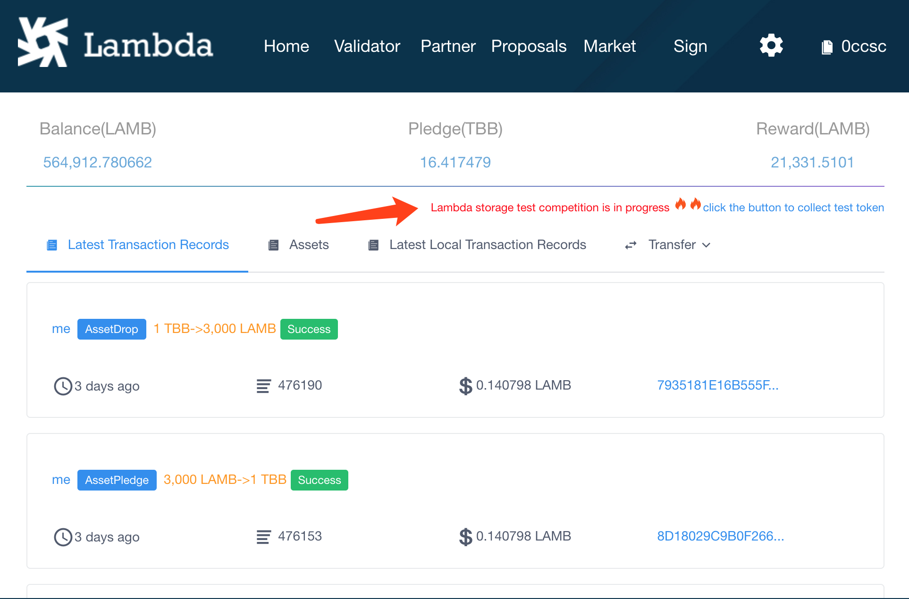
跳转到 
[http://faucet.lambda.im/](http://faucet.lambda.im/)

输入 创建的lambda主网地址，例如 lambda163q4m634nq8les4nuvdvz49tk6aeh926t0**** 

现在支持 领取测试网的LAMB和TBB,用以进行存储挖矿测试

领取规则：一个ip每天可以领取3000个LAMB,1个TBB
        一个lamb主网地址，可以分别领取一次LAMB和TBB


## 转账
点击首页的 Transfer 按钮 ，弹出转账对话框，填写转账的地址和金额


点击下一步，预览交易信息，可以修改gas

点击确定。弹出输入钱包密码的对话框，输入钱包密码


点击Submit，等待10s左右转账完成,转账成功效果如下


点击View Detail 查看转账详情


## 导出账号配置文件

在设置页面点击 Keystore File Backup,即可查看账号备份文件


## 更换钱包链接的Validator节点
在设置页面点击 Switch Validator 进入 查看Validator信息的页面


在输入框里面更改节点的IP地址,点击 Submit，切换成功后提示信息如下 


## LAMB兑换TBB

TBB可用于质押


## 查看验证节点和质押

第一列 我的质押列表
第二列 验证节点列表
点击到验证节点 列表
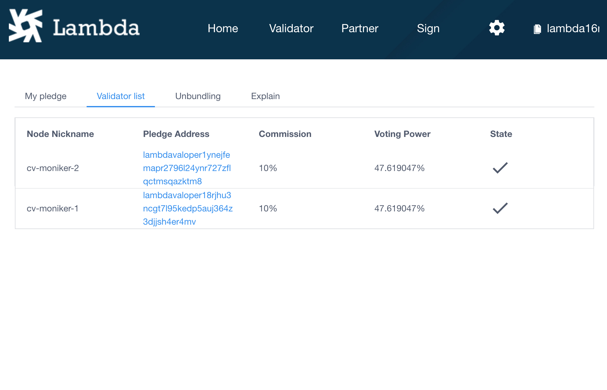
点击查看验证节点详细信息

点击质押按钮进行质押


## 转质押
在节点的详情页面点击转质押按钮

点击即可打开转质押窗口

填写需要转质押多少tbb，选择新的节点即可

（如果要转全部tbb，可能会失败，建议质押总量-0.1 个tbb 转质押比较容易成功）


## 取消质押
在节点的详情页面点击取消质押按钮

点击即可打开取消质押窗口
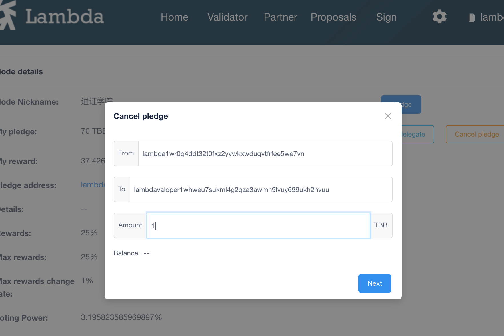
填写需要取消质押多少tbb

（如果要取消全部tbb，可能会失败，建议质押总量-0.1 个tbb 取消质押比较容易成功）


## 查看合伙人和质押
第一列 我的质押
第二列 合伙人列表

点击合伙人列表 查看全部的合伙人信息

点击查看合伙人详情

点击质押按钮可以进行质押
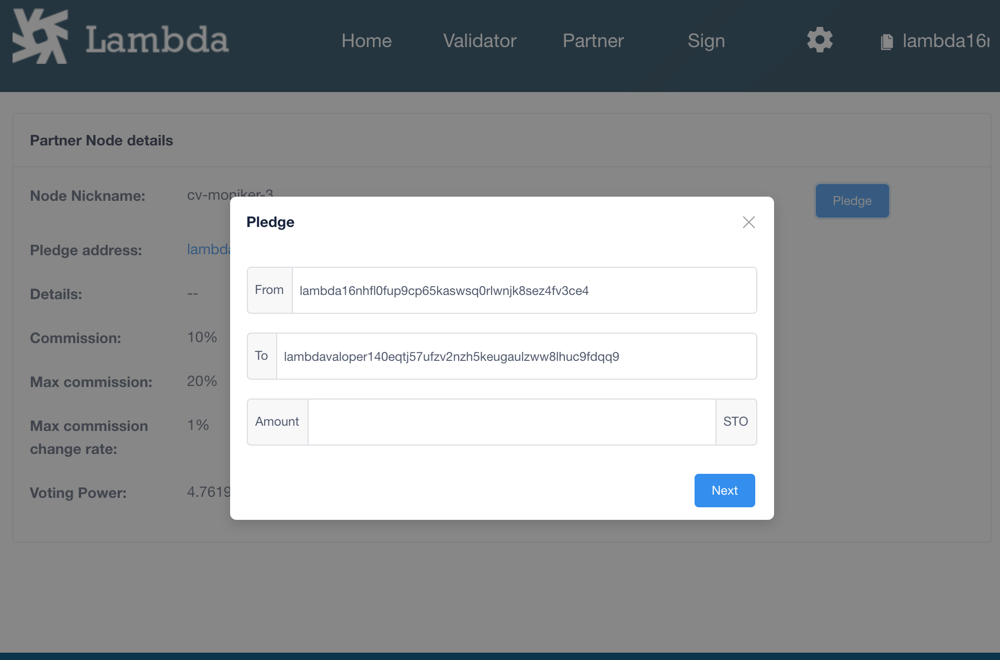

## 提取奖励
在首页点击【提取奖励】下拉菜单中的【提取奖励】
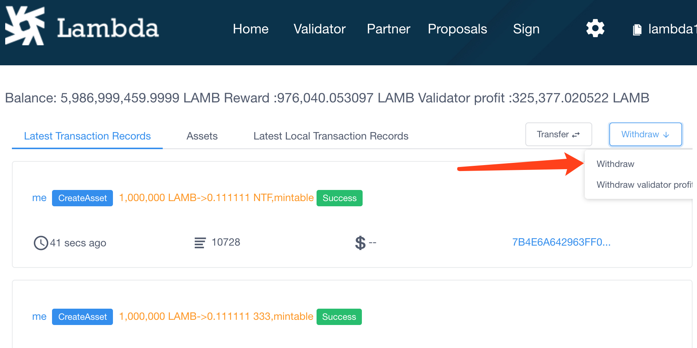


## 提取节点收益
在首页点击【提取奖励】下拉菜单中的【提取节点收益】

即可打开提取节点收益的窗口


## 查看资产和交易资产
在钱包首页点击资产标签，可以查看当前账户下有哪些资产
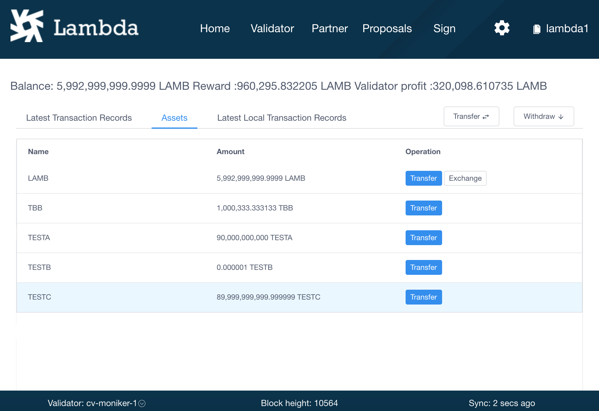
点击交易按钮可以打开交易资产的窗口
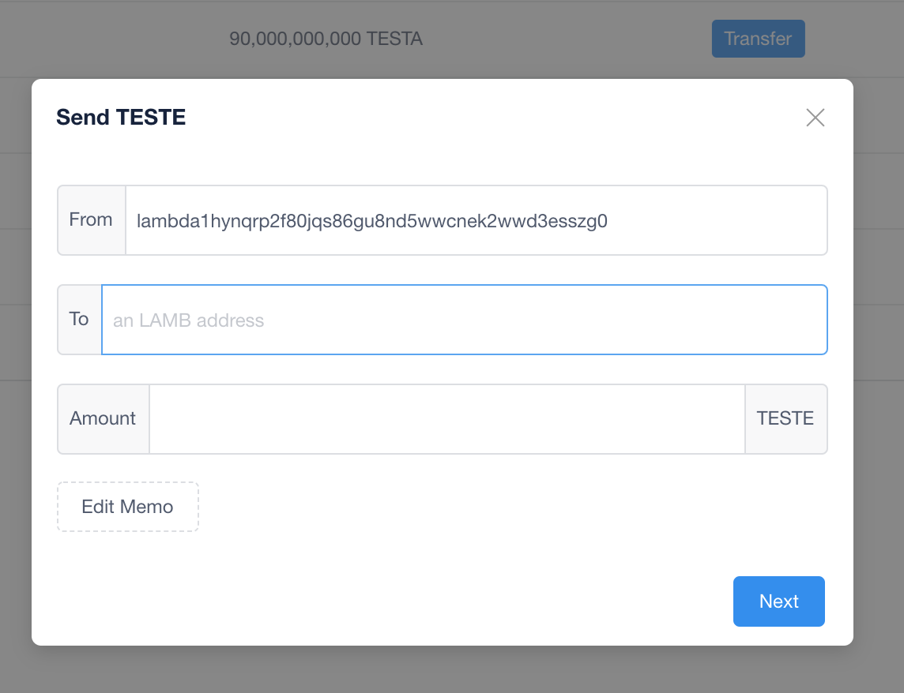

## 提案与存入押金和投票
点击顶部的导航菜单中的【提案】，即可进入提案列表页面
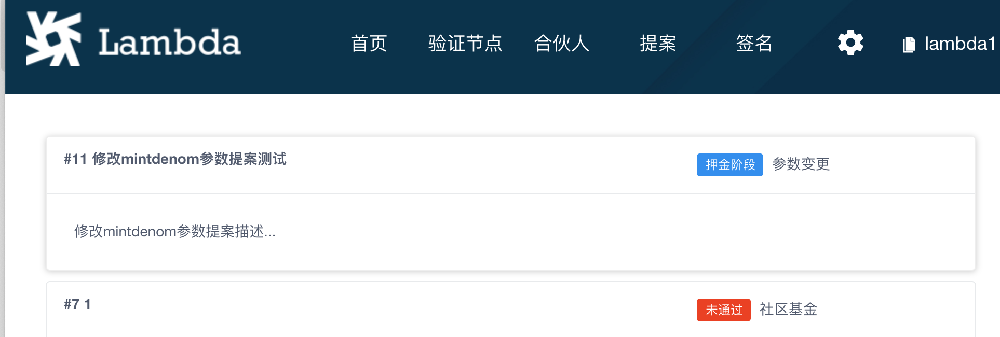
点击提案的的文字描述部分进入提案详情页面


提案状态为【押金阶段】时，可以给提案存入押金
点击存入押金按钮打开存入押金对话框

当存入总押金满足要求后，提案会进入【投票阶段】，点击投票按钮打开投票对话框


投票可以选择 同意 、反对、强烈反对、弃权

如果第一次投票投错了，没关系第二次投票会覆盖第一次投票的结果

投票的权重等于质押量，在节点质押和在合伙人质押都是有效质押

如果没有质押过，投票无效

## 市场与买卖空间

点击导航栏的市场链接进入市场页面


#### 我的订单列表 订单列表包含买单和卖单


购买空间 

购买空间有两种方式：一种是自动匹配购买，一种是选择某一个矿工优质卖单购买。

自动匹配购买的是赔率为1单价为5lamb的卖单。

优质卖单是赔率大于3单价大于5lamb的卖单，可指定购买。

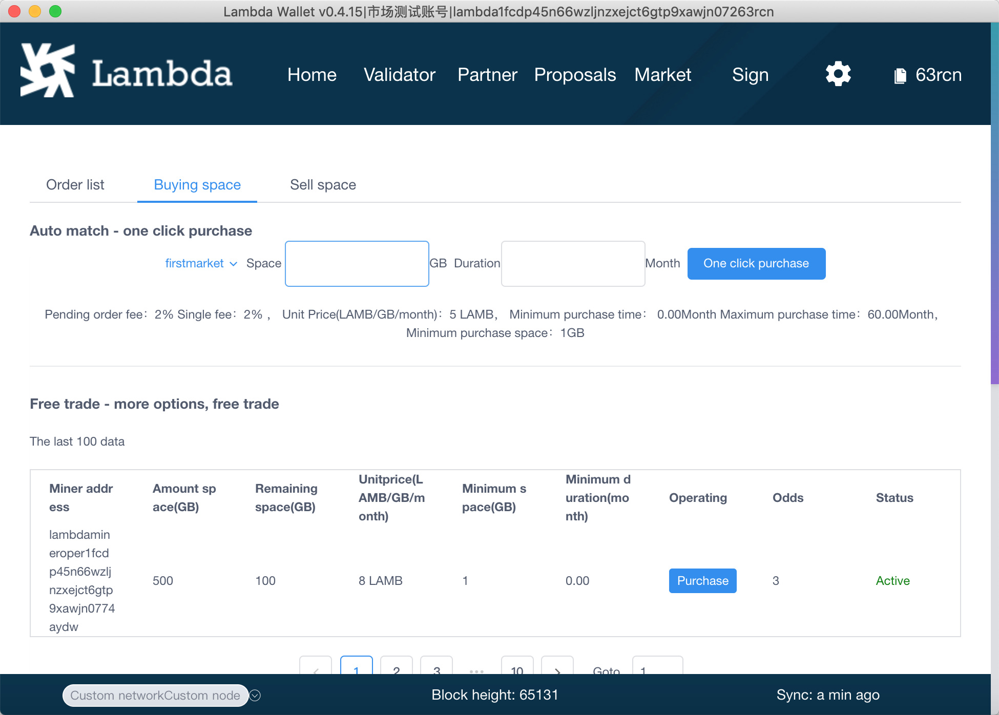

自动匹配购买空间只需要填写空间的大小和时长，例如购买3个月 2GB的空间


购买矿工的优质买单需要先选择一个矿工，查看订单的最低购买空间大小、最短购买时长、最长时长是否满足自己的需求， 如果满足，填写空间大小和时长即可购买

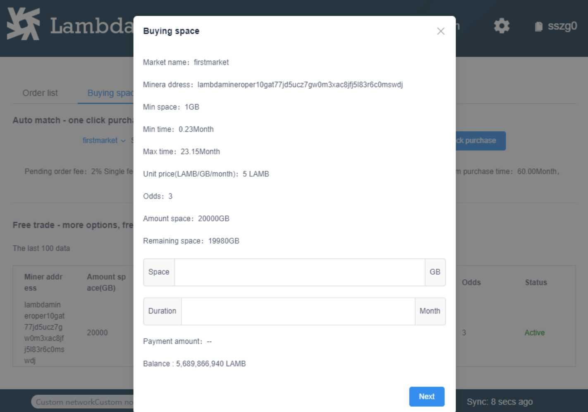


#### 出售空间
 如当前账户是矿工账户，这里会列出这个账户在市场中挂的卖单列表
 
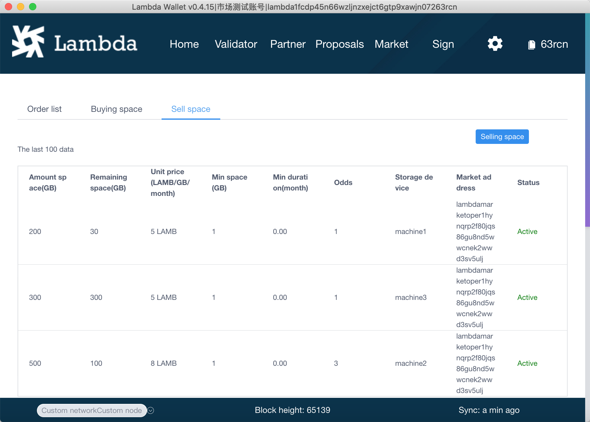
在挖矿程序中创建存储设备后，可以在钱包中挂设备的卖单

例如创建设备的命令


 ./lambdacli tx market create-machine \
 
 --dht-id HL4oGXqDQDMHyKpRWwxF9UmcnVvhxueDnghWu7zuMKMH  \ 
 
 --name machine1 --peer-id 3830e6d38b9e03ae6653 \
 
 --pub-key 1624de64201c233b87da4a2d27210ecb923e45ad0b8343352b0ab22ee9d5abbe9bdededd9b  \
 
 --from test1  \ 
 
 --broadcast-mode block -y


在弹出的对话框中选择设备，填写要卖的空间大小（一个设备如果已经挂一个卖单，就不能挂第二个卖单了）

、赔率、单价 还有限制用户购买的条件，最小购买的空间大小、最短时长、最长时长 即可

关于赔率
赔率=1不能指定价格，只能是5LAMB/G/month

赔率>=3需要指定价格,价格>=5LAMB/G/month

赔率=1为普通卖单,赔率>=3为优质卖单

只有优质卖单会出现在市场的列表里面，供用户选择，普通卖单只能进行自动匹配


 在订单列表页面点击 查看详情进入订单的详情页面
 
 卖单的详情页面
 


## 打开lambdaS3控制台
购买订单后，可以通过lambdaS3控制台来进行文件的上传下载，使用存储空间


如果需要使用这个订单的空间，可以在lambda storage中上传文件到空间和删除空间中的文件

点击打开控制台按钮， 弹窗授权对话框，即可完成对这个订单的授权

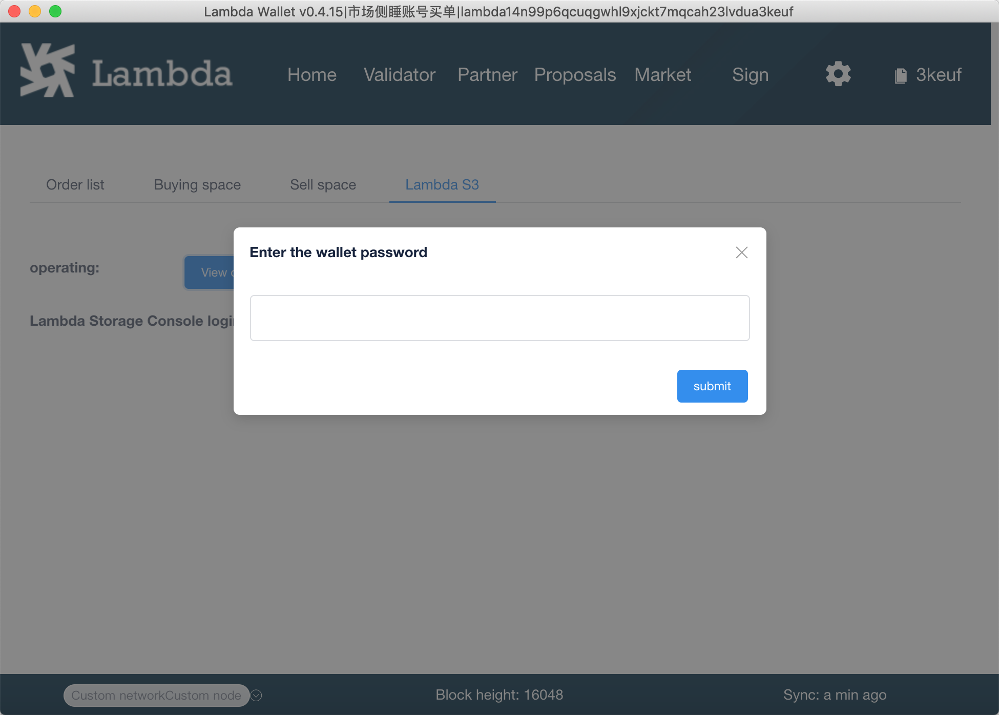

在登录页面输入：

钱包中提示的的lambda storage 控制台登录信息:密钥：lambda， 私钥：12345678

完成登录


就可以上传文件了，将文件拖拽到文件列表区域即可上传文件


## 主网和测试网的切换


登录钱包后 点击页脚左侧的网络类型，进入节点选择页面


点击默认主网ip 再点击提交 可切换到主网

点击默认测试网ip 再点击提交  可切换到测试网


