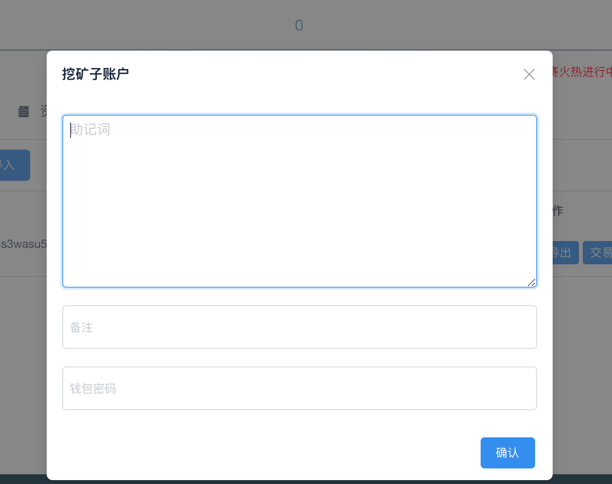
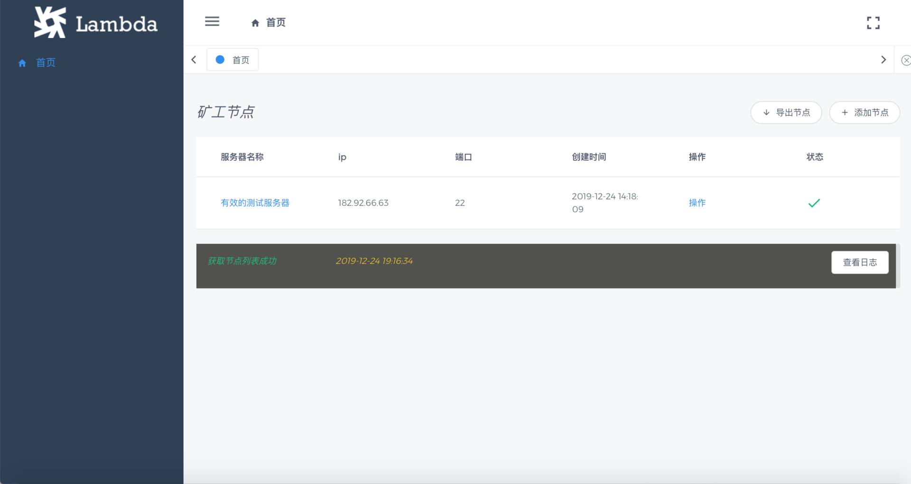
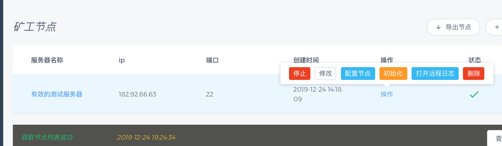
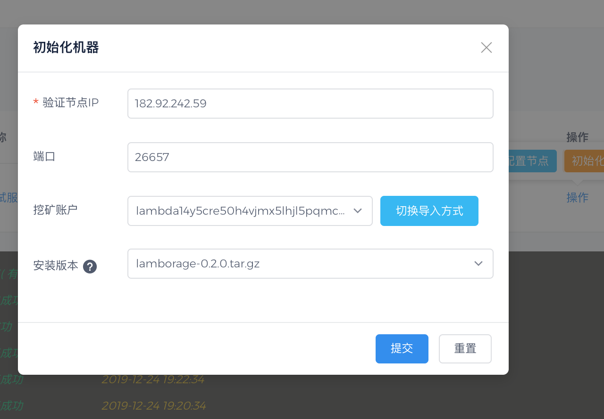
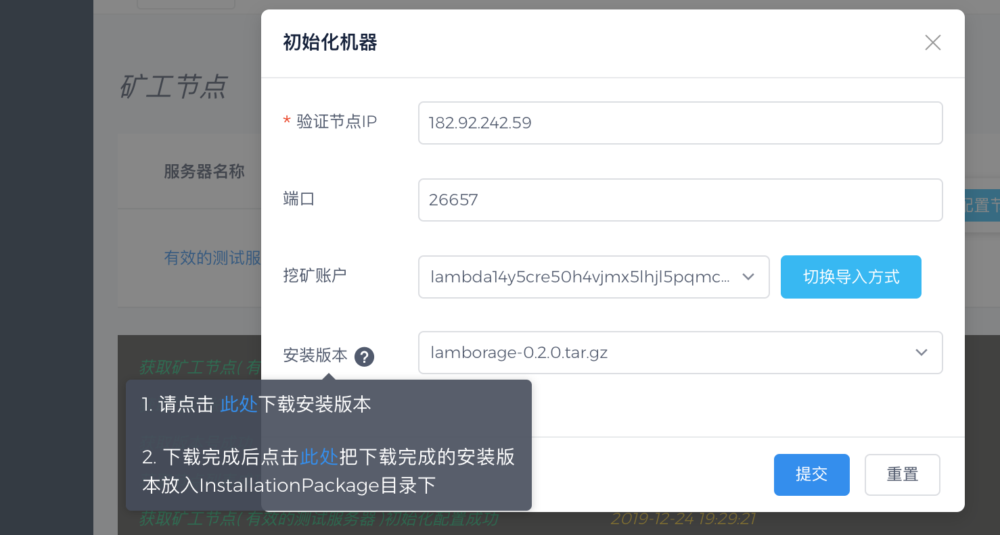
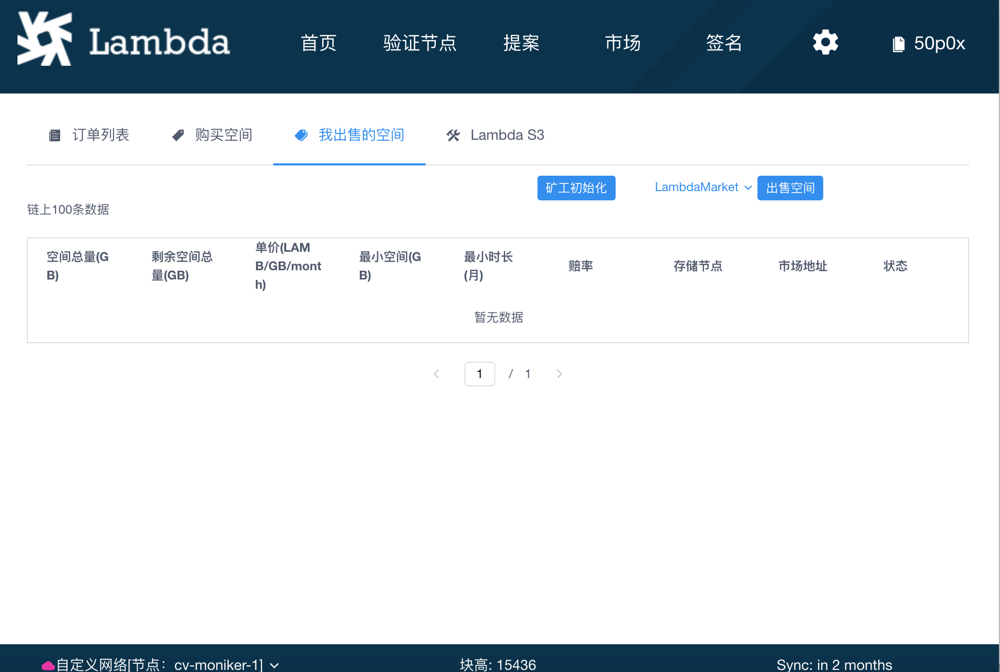
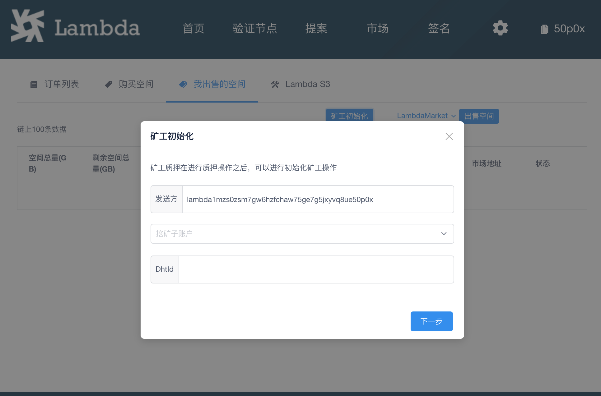
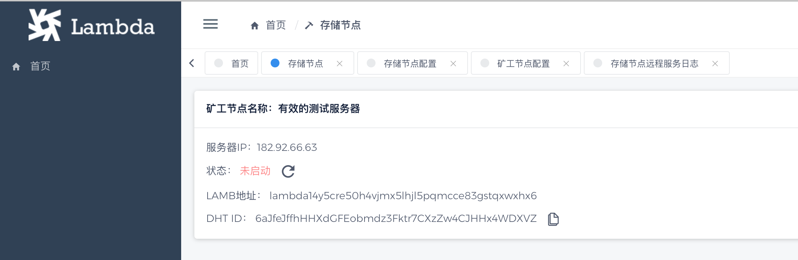

# 矿工管理程序使用教程

相关资源

矿工管理程序下载地址：
[https://github.com/LambdaIM/launch/releases/tag/StorageManager0.1.12](https://github.com/LambdaIM/launch/releases/tag/StorageManager0.1.12)
[http://download.lambdastorage.com/storage-manager/0.1.12/](http://download.lambdastorage.com/storage-manager/0.1.12/)

钱包下载地址：  
[https://github.com/LambdaIM/launch/releases/tag/Wallet0.4.40](https://github.com/LambdaIM/launch/releases/tag/Wallet0.4.40)  
[http://download.lambdastorage.com/wallet/0.4.40/](http://download.lambdastorage.com/wallet/0.4.40/)

矿工和存储节点安装包：  
[https://github.com/LambdaIM/launch/releases/tag/v0.4.5](https://github.com/LambdaIM/launch/releases/tag/v0.4.5)
[http://download.lambdastorage.com/lambda-storage/0.2.3/](http://download.lambdastorage.com/lambda-storage/0.2.3/)

使用矿工管理程序配合钱包即可添加配置矿工服务及存储节点服务，非常便利

* [1使用钱包质押](#1使用钱包质押)
* [2钱包创建挖矿子账户及导出](#2钱包创建挖矿子账户及导出)
* [3添加矿工节点服务器](#3添加矿工节点服务器)
* [4矿工初始化](#4矿工初始化)
* [5钱包初始化矿工](#5钱包初始化矿工)
* [6配置矿工节点](#6配置矿工节点)
* [7添加存储节点](#7添加存储节点)
* [8初始化存储节点](#8初始化存储节点)
* [9配置存储节点](#9配置存储节点)


## 1使用钱包质押
打开钱包，点击【验证节点】标签页

点击【验证节点列表】

选一个节点 点击【质押地址】进入验证节点详情页

点击质押按钮质押到当前节点，质押不得少于1TBB


## 2钱包创建挖矿子账户及导出

在钱包【首页】点击【子账户】链接，切换到子账户标签页


可以看到【创建矿工子账户】和【导入】按钮

### 创建子账户
点击创建子账户按钮，打开创建子账户弹窗



创建矿工子账户需要输入当前钱包的助记词和密码，输入备注方便记忆

也可以导入钱包或区块链程序导出的子账户

### 导入子账户
如果已有子账户json文件，可通过钱包导入子账户。如已进行上面创建子账户操作，可跳过此步。

点击导入按钮，打开导入矿工子账户弹窗


导入子账户需要选择子账户的json文件和当前钱包的密码

### 导出子账户
如果需要在矿工管理程序或区块链程序中使用挖矿子账户，可以导出子账户


导出子账户需要输入当前钱包的密码


## 3添加矿工节点服务器
点击 StorageManager 打开管理程序


这是管理程序的首页



矿工管理程序 点击 【添加节点】 ，选择【通过密码添加节点】或【通过私钥添加节点】


1 通过用户名和密码添加 


2 通过私钥添加


添加成功后可以看到相关操作



## 4矿工初始化
点击【初始化】按钮打开初始化界面



初始化需要填写的信息注意事项

1. 验证节点IP：链接测试网就填写测试网的验证节点IP，链接主网就填写主网的节点IP

2. 端口：填写对应验证节点的rpc端口，一般为26657

3. 挖矿子账户有 选择本地文件 和 选择本地钱包导出的挖矿子账户 两种方式

  选择本地文件是 本地有之前通过钱包或链导出的挖矿子账户的json文件

  如果本机也安装了lamb钱包，钱包导出的挖矿子账户就会出现在下拉列表中


4. 安装文件包，需要先将需要安装的挖矿程序包下载到管理程序指定的文件夹中，点击提交的时候会自动上传安装包。



## 5钱包初始化矿工

点击钱包的【市场】页面，再点击【我出售的空间】面板，可以看到【矿工初始化】按钮



点击【矿工初始化】按钮，打开创建矿工弹窗



创建矿工需要选择钱包中的子账户 和 矿工服务器的DHT ID  

可以在 矿工管理程序——矿工节点页面点击服务器名称——进入矿工节点详情页 获取矿工服务的 DHT ID 

例如  



## 6配置矿工节点
点击【配置节点】按钮打开配置界面


矿工节点配置分6个模块 分别是build, db, kad, log, miner, server

启动矿工必须要填写的配置如下：

server.address

server.private_address

kad.external_address

kad.bootstrap_addr

miner.root_secret_seed

参考如下说明进行配置(实际修改了对应服务器的配置文件~/.lambda_miner/config/config.toml):

```
####
## Not used in v0.2.3, will be removed after v0.2.3
version = "0.2.3"
commit = "20b8847d14a32481e64bae8617abbe7b55cac45b"
mode = "release"
ensure_level = "0"
####

[build]
version = "0.2.3"
commit = "20b8847d14a32481e64bae8617abbe7b55cac45b"
mode = "release"

# 服务需要监听的地址
# 以本机内网IP为 192.168.10.10，端口映射的外网IP为 200.200.200.100 为例
[server]
# 对外提供服务的地址，推荐配置为内网地址做端口映射到外网IP
address = "192.168.10.10:13000"
# 对内提供服务的地址，主要是给StorageNode使用，推荐配置为内网地址
private_address = "192.168.10.10:13001"
debug_log_traffic = "false"

[kad]
# DHT接入节点地址，存储网络提供，可填写多个，以 47.94.129.97:13000 为例
# 可选dht地址：39.105.148.217:13000/47.94.129.97:13000/47.93.196.236:13000/182.92.66.63:13000
bootstrap_addr = ["47.94.129.97:13000"]
# time you would wait to connect dht seed node
bootstrap_backoff_max = "30s"
bootstrap_backoff_base = "1s"
db_path = "/root/.lambda_miner/kademlia"
# this should listen at Public IP
## 对外暴露的提供服务的地址
external_address = "200.200.200.100:13000"
alpha = 3

[kad.routing_table_config]
bucket_size = 20
replacement_cache_size = 5


####
## Not used in v0.2.3, will be removed after v0.2.3
[api_key]
root_secret_seed = ""
####

[miner]
# ensure_level=0会多占用磁盘1/6空间，ensure_level=1会多占用1/3空间
ensure_level = "0"
#root access key，不能为空
root_secret_seed = "aaa"

[log]
level = "info"
output_file = "stdout"

[db]
# db config
lru_cache = "131072"
keep_log_file_num = "100"
write_buffer_size = "134217728"
recycle_log_file_num = "0"
target_file_size_base = "268435456"
max_write_buffer_number = "4"
max_bytes_for_level_base = "4294967296"
level_0_stop_writes_trigger = "24"
target_file_size_multiplier = "1"
max_background_compactions = "2"
max_bytes_for_level_multiplier = "2"
level_0_slowdown_writes_trigger = "17"
level_0_file_num_compaction_trigger = "8"
level_compaction_dynamic_level_bytes = "0"
compaction_algorithm = "0"
rate_bytes_per_sec = "10240"
data_backup_path = ""
data_backup_interval = "300000000000"
```
配置完成后可以点击启动按钮，启动矿工服务，成功后状态会变成绿色的☑️


如果启动后状态没有变化 可以点击打开远程日志按钮，查看日志

一般如果是缺少配置导致的失败，日志里面会列出必填的配置项是哪些


## 7添加存储节点
点击服务器名称进入矿工详情页面


添加存储节点服务器的方式和添加矿工的方式类似

## 8初始化存储节点
点击【操作】下拉框 —— 点击【初始化】 —— 选择安装版本


点击提交按钮即可成功初始化

## 9配置存储节点


存储节点必填配置如下：

server.address

server.private_address

kad.bootstrap_addr

kad.external_address

storage.storage_name

storage.miner_address

storage.root_secret_seed

`~/.lambda_storage/config/config.toml` 配置说明

```
# 服务需要监听的地址
# 以本机内网IP为 192.168.10.20，端口映射的外网IP为 200.200.200.200 为例
[server]
# 对外提供服务的地址，推荐配置为内网地址做端口映射到外网IP
address = "192.168.10.20:14000"
# 对内提供服务的地址，主要是给StorageNode使用，推荐配置为内网地址
private_address = "192.168.10.20:14001"
debug_log_traffic = "false"


[kad]
# address you want kad to connect with
# DHT接入节点地址，可以是存储网络提供的地址，也可以是minernode暴露到外网的IP，这里以 47.94.129.97:13000 为例
# 可选dht地址：39.105.148.217:13000/47.94.129.97:13000/47.93.196.236:13000/182.92.66.63:13000
bootstrap_addr = ["47.94.129.97:13000"]
# time you would wait to connect dht seed node
bootstrap_backoff_max = "30s"
bootstrap_backoff_base = "1s"
db_path = "/root/.lambda_storage/kademlia"
# this should listen at Public IP
external_address = "200.200.200.200:14000"
alpha = 3

[kad.routing_table_config]
bucket_size = 20
replacement_cache_size = 5

[log]
level = "info"
output_file = "stdout"

[storage]
## 用于生成apikey的种子内容，不能为空
root_secret_seed = "fasdf"
## 存储路径，可填写多个以逗号隔开
data_dir = [ "/root/.lambda_storage/store"]
## minernode对内提供服务的地址，即它的server.private_address
miner_address = "192.168.10.10:13001"
## 存储节点的名字，需要在矿池内部唯一，即连接同一矿工的多个storagenode的storage_name不能重复
storage_name = "machine1"

[mining]
## 挖矿记录的数据文件
db_path = "/root/.lambda_storage/statementdb"
## 存储挖矿文件(删除的)的存储路径，可填写多个以逗号隔开
mining_dir = [ "/root/.lambda_storage/mining"]
```
配置完成之后

勾选框 选中存储节点，然后点击【启动】


如果启动后状态没有变化 可以点击打开远程日志按钮，查看日志

一般如果是缺少配置导致的失败，日志里面会列出必填的配置项是哪些


