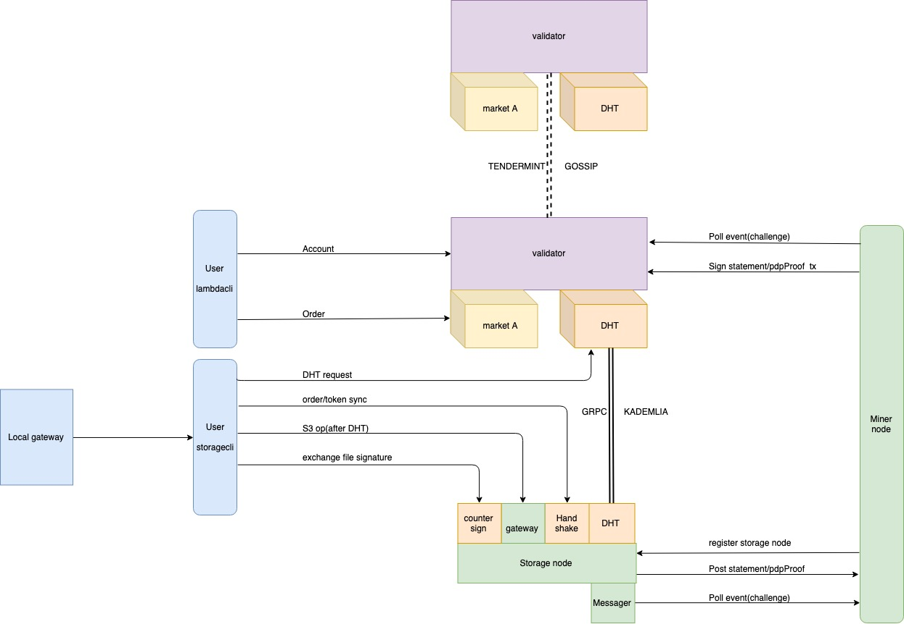

1个miner对应多个storagenode   


* [配置miner：](#配置miner节点)
* [1. 下载安装包并解压](#1下载安装包并解压)
* [2. 配置miner](#2配置miner)
* [3. 添加矿工账户](#3添加矿工账户)
* [4. 创建miner](#4创建miner)
* [5. 初始化storagenode](#5初始化storagenode)
* [6. storagenode配置和启动](#6storagenode配置和启动)
* [7. 矿工创建卖单](#6矿工创建卖单)
* [8. 创建买单](#7创建买单)
---
* [挖矿及文件上传查看：](#挖矿及文件上传查看)
* [1. 挖矿配置](#1配置)
* [2. 上传文件](#2上传文件)
* [3. 矿工挖矿](#3矿工挖矿)
* [4. 挖矿收益](#4挖矿收益)
---
* [提取订单收益](#提取订单收益)


# 存储业务架构图


# 配置miner节点

## 1下载安装包并解压

创建目录并进入 

```
mkdir -p ~/LambdaIM && cd ~/LambdaIM
```
下载安装包
```
wget https://github.com/LambdaIM/launch/releases/download/0.2.0/lambda-storage-0.2.0-testnet.tar.gz
```
解压安装包
```
tar zxvf lambda-storage-0.2.0-testnet.tar.gz
```
进入解压后的目录
```
cd lambda-storage-0.2.0-testnet
```

## 2配置lambdacli

```
./lambdacli config node tcp://47.93.196.236:26657

可选节点IP如下:
47.93.196.236
47.94.129.97
39.105.148.217
182.92.66.63
```

```
 ./lambdacli config chain-id lambda-chain-test4.3
```

```
./lambdacli config trust-node true
```
## 3添加矿工账户
将[your-account-name]替换成您自定义的矿工账户名称，需要设置您的账户密码，不用加中括号  
矿工子账户用来提交挖矿声明和挖矿证明，每笔交易需要一定的手续费，需要保证矿工子账户余额大于1000LAMB

提示：也可以使用钱包进行添加矿工账户、导入/导出矿工子账户、转账、质押等操作

### 添加矿工账户及矿工子账户
```
./lambdacli keys add [your-account-name] --generate-miner 
```


如果是钱包创建的账户导入，则通过钱包创建账户时候的助记词进行操作

```
./lambdacli keys add [your-account-name] --recover --generate-miner 
```
输入命令后按照提示输入密码和助记词即可


### （本地已有矿工账户时）仅生成矿工子账户
```
./lambdacli keys create-miner [your-account-name] 
```
输入命令后按照提示输入助记词即可


## 4创建miner
质押到节点。
节点地址 可通过浏览器查找 http://testbrowser.lambda.im/#/ 或询问节点，
[your-account-name] 是您在第3步创建的账户名称
### 质押资产到节点
```
./lambdacli tx staking delegate lambdavaloper1prrcl9674j4aqrgrzmys5e28lkcxmntxuvjpcl 20000000utbb \
--from [your-account-name] --broadcast-mode block -y
可选节点地址：
lambdavaloper1prrcl9674j4aqrgrzmys5e28lkcxmntxuvjpcl
lambdavaloper1thj5fv8d0dsh3aealhpxm9mvgxjfh87suwuj2h
lambdavaloper1a83p8s9gs5hua09xn5ktmahepst3vzg9u2l20d
lambdavaloper1r340rrv9fs95gqy5087e2mtz82vvwrglt6amx3
```

### 初始化矿工及配置
```
./minernode init
```
会生成矿工配置文件~/.lambda_miner/config/config.toml，参考如下说明进行配置
```
# 服务需要监听的地址
# 以本机内网IP为 192.168.10.10，端口映射的外网IP为 200.200.200.100 为例
[server]
# 对外提供服务的地址，推荐配置为内网地址做端口映射到外网IP
address = "192.168.10.10:13000"
# 对内提供服务的地址，主要是给StorageNode使用，推荐配置为内网地址
private_address = "192.168.10.10:13001"
debug_log_traffic = "false"

[kad]
# DHT接入节点地址，存储网络提供，可填写多个，以 47.94.129.97:13000 为例
# 可选dht地址：39.105.148.217:13000/47.94.129.97:13000/47.93.196.236:13000/182.92.66.63:13000
bootstrap_addr = ["47.94.129.97:13000"]
# time you would wait to connect dht seed node
bootstrap_backoff_max = "30s"
bootstrap_backoff_base = "1s"
db_path = "/root/.lambda_miner/kademlia"
# this should listen at Public IP
## 对外暴露的提供服务的地址
external_address = "200.200.200.100:13000"
alpha = 3

[kad.routing_table_config]
bucket_size = 20
replacement_cache_size = 5

[api_key]
#root access key，不能为空
root_secret_seed = "yah"

[log]
level = "info"
output_file = "stdout"

[db]
# db config
lru_cache = "131072"
keep_log_file_num = "100"
write_buffer_size = "134217728"
recycle_log_file_num = "0"
target_file_size_base = "268435456"
max_write_buffer_number = "4"
max_bytes_for_level_base = "4294967296"
level_0_stop_writes_trigger = "24"
target_file_size_multiplier = "1"
max_background_compactions = "2"
max_bytes_for_level_multiplier = "2"
level_0_slowdown_writes_trigger = "17"
level_0_file_num_compaction_trigger = "8"
level_compaction_dynamic_level_bytes = "0"
compaction_algorithm = "0"
rate_bytes_per_sec = "10240"
data_backup_path = ""
data_backup_interval = "300000000000"
```

### 查看矿工子账户地址
将第三步生成的[your-account-name]_miner_key.json文件重命名为`default_miner_key.json`并移动到`~/.lambda_miner/config/`:
```
mv [your-account-name]_miner_key.json ~/.lambda_miner/config/default_miner_key.json
```

查询矿工子账户地址：
```
./minernode show-address 
返回如下结果：
Master Address: lambda1fzeqzcemyye2qx2338clwss7nx3ukr7rx88snz //矿工账户地址
Miner Address: lambda1wgdcvew36nqwm2d5gj6yxraayjvnhfpf5rrfww  //矿工子账户地址
```

### 给子账户转账
[miningAddr] 为上面查询到的矿工子账户地址
```
./lambdacli tx send [miningAddr] 1000000000ulamb --from [your-account-name] --broadcast-mode block -y
```

### 创建矿工
[miner-name] 是您在第3步创建的矿工账户名称。  
[miningAddr] 为矿工子账户地址。
[dht-id] 使用`./minernode info`查询
```
./minernode info
返回结果：
                dht id: CdZsGtfsXVjMgt51EnaGAqr78YmgFxYsCAn4ubR1Dpgo //创建矿工时会用到此dht-id
        server.address: 0.0.0.0:14000
  kad.external_address: 182.92.242.59:14000
    kad.bootstrap_addr: [182.92.242.59:13000]
server.private_address: 127.0.0.1:14001

创建矿工命令：
./lambdacli tx market create-miner --dht-id [dht-id] --mining-address [miningAddr] --from [miner-name] --broadcast-mode block -y
```
### 启动矿工服务
[log_file_path] 指定矿工日志完整路径
```
./minernode run --query-interval 5 --daemonize --log.file [log_file_path]

如[your-account-name]_miner_key.json没有移动到~/.lambda_miner/config/default_miner_key.json，则加上--key-file参数启动：
./minernode run --query-interval 5 --daemonize --log.file [log_file_path] --key-file [filepath/your-account-name]_miner_key.json

```


### 查看矿工服务进程
```
./minernode run --status
```
```
返回结果如下即进程在运行中：
minernode.pid is running, pid is 19276
```

### 停止矿工服务
```
./minernode run --stop
```
```
返回结果如下即停止矿工服务成功：
stop daemon process from minernode.pid:19276 successfully
```

## 5初始化storagenode

```
./storagenode init
```
生成存储节点配置文件~/.lambda_storage/config/config.toml，参考如下第6步进行配置

## 6storagenode配置和启动
[storagenode配置启动参考](./Testnet0.4.3-Storagenode-configure.md)

## 7矿工创建卖单

加上--normal参数（赔付比率rate为0.5）的是普通卖单，价格只能等于5000000ulamb；
不加--normal参数（赔付比率等于1）的为优质卖单，优质卖单可指定大于等于5000000ulamb的任意价格。  
设置需要卖出的空间大小size；   
最小购买空间min-size不能小于1GB;  
最小购买时长min-buy-duration不能小于1month;  
最大购买时长max-buy-duration不能大于60month。

注意：测试网中尽量挂优质卖单（不加--normal参数），这样创建买单时才能指定卖单ID匹配到自己矿工的卖单。

### 创建普通卖单

一个矿工可创建多笔卖单，卖单总空间不能大于质押TBB数量，例如：一个矿工质押了1000000utbb（即1TBB），创建卖单总空间不能超过1TB（即1000GB）

```
./lambdacli tx market create-sellorder --price 5000000ulamb  \
--normal \
--size [size]GB \
--market-name LambdaMarket \
--min-size [min-size]GB \
--min-buy-duration [min-buy-duration]month \
--max-buy-duration [max-buy-duration]month \
--from [miner-name] --broadcast-mode block -y
```

### 创建优质卖单

```
./lambdacli tx market create-sellorder --price [sellorder-price]  \
--size [size]GB \
--market-name LambdaMarket \
--min-size [min-size]GB \
--min-buy-duration [min-buy-duration]month \
--max-buy-duration [max-buy-duration]month \
--from [miner-name] --broadcast-mode block -y
```
### 查询卖单


```
查询账户地址：
./lambdacli keys show [miner-name] --address
根据账户地址查看矿工卖单：
./lambdacli query market miner-sellorders [address] [page] [limit] 

例如：
查看账户名为miner2的地址：./lambdacli keys show miner2 --address
返回结果：lambda1k6rxrmly7hz0ewh7gth2dj48mv3xs9yz8ffauw

./lambdacli query market miner-sellorders lambda1k6rxrmly7hz0ewh7gth2dj48mv3xs9yz8ffauw 1 10
返回结果：
SellOrder
  OrderId:            54F82FBD979BE150C8B3246D82DDF60F043129EE  //卖单ID，取消卖单或创建优质买单时需要用到此ID
  Address:            lambdamineroper1k6rxrmly7hz0ewh7gth2dj48mv3xs9yznx96fn
  Price:              5000000
  Rate:               1.000000000000000000  //rate等于1，则该卖单为优质卖单
  Amount:
  SellSize:           400
  UnUseSize:          0
  Status:             1
  CreateTime:         2019-11-04 12:02:24.379880755 +0000 UTC
  CancelTimeDuration: 1h0m0s
  MarketAddress:      lambdamarketoper1thj5fv8d0dsh3aealhpxm9mvgxjfh87srk3887
  MachineName:        machine1
  MinBuySize:         1
  MinDuration:        720h0m0s
  MaxDuration:        43200h0m0s
```

### 取消卖单

根据SellOrderID取消卖单
```
./lambdacli tx market cancel-order [orderId] --from [miner-name] --broadcast-mode block -y
```


## 8创建买单
矿工不能买自己的卖单，只能换其他账户来挂买单。

创建优质买单需要指定对应优质卖单SellOrderID。

account-name为当前账户的名称；
duration为购买时长；
size为需要购买的空间，不小于对应卖单指定的最小购买空间。

### 创建普通买单

```
 ./lambdacli tx market create-buyorder --from [account-name] \
 --duration [buy-duration]month --market-name LambdaMarket \
 --size [size]GB --broadcast-mode block -y
```

### 创建优质买单
[orderId] 可指定1个或多个优质卖单ID，指定多个卖单ID时以逗号分隔，例如：58941CFFEEA859AED51172F0F9DF3E77293D2E12,54F82FBD979BE150C8B3246D82DDF60F043129EE
```
./lambdacli tx market create-buyorder --sellorder-id [orderId] \
--from [your-account-name] --duration [buy-duration]month \
--market-name LambdaMarket --size [size]GB --broadcast-mode block -y
```

### 查询匹配订单

```
查询账户地址：
./lambdacli keys show [account-name] --address
根据账户地址查看匹配订单：
./lambdacli query market matchorders [address] [page] [limit]

例如：
./lambdacli keys show buyaccount --address
返回结果：lambda1thj5fv8d0dsh3aealhpxm9mvgxjfh87s224esr
./lambdacli query market matchorders lambda1thj5fv8d0dsh3aealhpxm9mvgxjfh87s224esr 1 10
返回结果：
MatchOrder
  OrderId:               05F09566BA4397BC9EB378EC202676D3FFCAF660   //匹配订单ID，上传文件时需要用到该ID
  AskAddress:            lambdamineroper1k6rxrmly7hz0ewh7gth2dj48mv3xs9yznx96fn
  BuyAddress:            lambda1thj5fv8d0dsh3aealhpxm9mvgxjfh87s224esr
  SellOrderId:           58941CFFEEA859AED51172F0F9DF3E77293D2E12
  BuyOrderId:            F3B5BDE351253E1D47DA7CEB24C0E4BAB5BDA808
  Price:                 5000000
  Size:                  20
  CreateTime:            2019-11-01 13:20:58.296399278 +0000 UTC
  EndTime:               2019-12-01 13:20:58.296399278 +0000 UTC
  CancelTimeDuration:    1h0m0s
  WithDrawTime:          2019-11-01 13:20:58.296399278 +0000 UTC
  Status:                0
  MarketAddress:         lambdamarketoper1thj5fv8d0dsh3aealhpxm9mvgxjfh87srk3887
  MachineName:           machine1
  UserPay:               100000000ulamb
  MinerPay:              100000000ulamb
  PubKey:                PubKeyEd25519{5AD2B4ECA8C33922A8228A5217900E5725BF3013639118D1002B6A413971F9DC}
  PeerId:                bdd4da2a3021d30e8f215dba64716cec02cdb8a7
  DhtId:                 5i6fXKQJoktPVmt9PAfZ18RN7DG6tghQN7SK7A3Bq4Rc
```


# 挖矿及文件上传查看

## 1配置

初始化storagecli
```
./storagecli init
```
初始化storagecli 后会默认生成配置文件~/.lambda_storagecli/config/user.toml，修改user.toml

```
[broker]
# dht_gateway_addr为验证节点的dht服务 IP和端口；
# 可选dht地址：39.105.148.217:13000/47.94.129.97:13000/47.93.196.236:13000/182.92.66.63:13000
dht_gateway_addr = "39.105.148.217:13000" 
# validator_addr为验证节点IP和端口
# 可选地址：39.105.148.217:13659/47.94.129.97:13659/47.93.196.236:13659
validator_addr = "39.105.148.217:13659"   

[gateway]
# local listen address
address = "0.0.0.0:9002"
# for login web UI
access_key = "accesskey"
secret_key = "secretkey"
```
同步所有订单的token

account-name 为发起买单账户名称
```
./storagecli token sync [account-name]
```


## 2上传文件

文本/图片/视频/音频/可执行文件/压缩包文件可正常上传。上传源文件路径为绝对路径。

- orderId为匹配单orderID;
- account-name为发起买单账户名称；
- bucket-name 可设置为长度大于等于3的任意字符，一个订单下可以有多个bucket

### 上传文件

```
创建bucket：
LAMBDA_ORDER_ID=[orderId] ./storagecli mb [account-name] lamb://[bucket-name]/

上传文件：
LAMBDA_ORDER_ID=[orderId] ./storagecli cp [account-name] [srcPath] lamb://[bucket-name]/ 

```


### 查看上传文件列表

```
LAMBDA_ORDER_ID=[orderId] ./storagecli ls lamb://[bucket-name]/ 
```

## 3矿工挖矿

矿工每存储文件1G文件会对应生成一个声明，所有声明有效期为1个月，每个出块周期（大约每6s出一个块）会由共识网络发起挑战，挑战声明成功并提交挖矿证明的矿工就会得到一笔收益。


1. 有效订单且有效存储文件 >= (1T) 的矿工有挖矿权利；
2. 矿工已存文件分别为1/3/5G可生成对应1/3/5个声明；
3. 单个矿工声明越多，该矿工被挑选到的概率越大。


## 4挖矿收益
矿工收益 = 单个区块增发量 * （43% * 95% / 挖矿的矿工数量） + 单个区块增发量 * （43% * 5% / 挖矿的矿工数量 ）* 矿工质押量在节点质押量的占比 * 75%

```
比如单个区块增发量为100LAMB，全网共1个节点该节点质押666TBB，全网共10个矿工分别质押1TBB且分别有10个声明。
则单个矿工单个区块得到的挖矿奖励为4.085LAMB= 100LAMB * 43% * 95% / 10 + 100LAMB * 43% * 5% / 10 * 1/676 * 75%
```

# 提取订单收益
[提取单个匹配订单收益](./docs/lambdacli/tx/market/withdraw-miner.md)  
[批量提取匹配订单收益](./docs/lambdacli/tx/market/miner-withdraw-machine.md)


