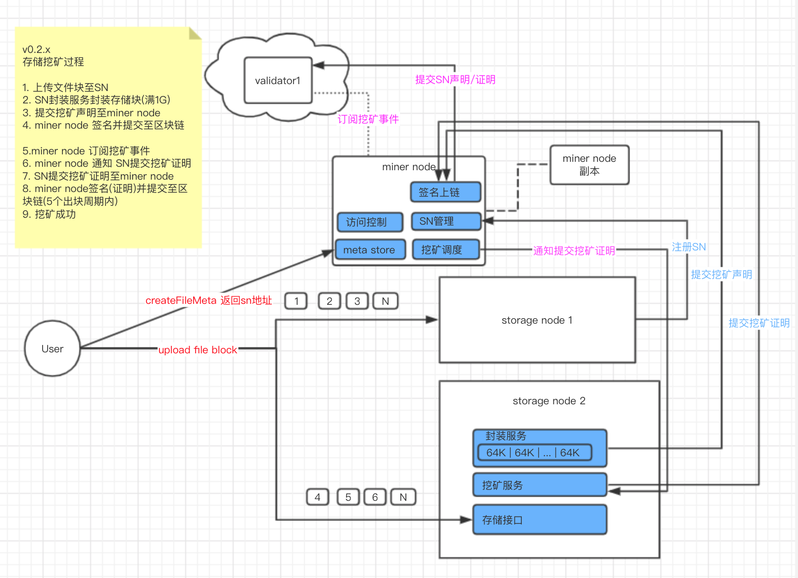
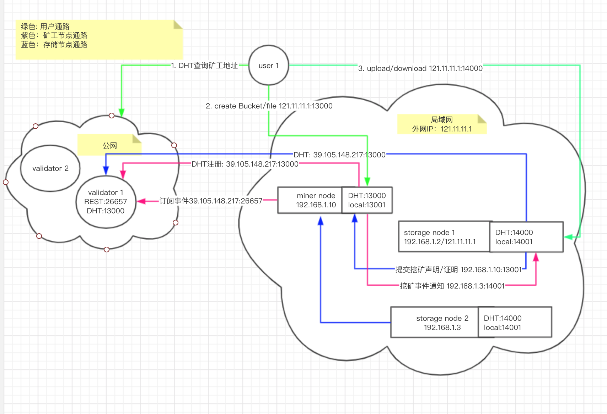

# 挖矿
## 挖矿环境
### 矿机配置
CPU：4核+  
内存：8G+  
带宽：5M+(有公网IP)  
磁盘：1T+  


### 环境管理
#### 查看配置
```
./storagecli   config
./lambdacli    config
./storagenode  info disk
./storagenode  info network
./minernode    info
```
#### 检查网络步骤
1. 检查是否开启防火墙
2. 检查端口映射是否成功
3. 检查配置是否正确

#### 测试网络配置
```
./minernode   info --test
./storagenode info network --test
```
#### 多磁盘配置
```
#～/.lambda_storage/config/config.toml
[storage]
data_dir = [ "磁盘1", "磁盘2", "磁盘N"]
```

#### 多存储节点配置
```
# 与单节点配置相同
# miner node自动分配存储节点进行存储
```
#### 查看存储节点
```
./minernode storage list
```
#### 查看订单使用空间
```
./storagenode info disk
```

## 存储挖矿
### 存储架构


### 网络架构


### 挖矿子帐户
用途：minernode提交挖矿声明、挖矿证明交易

生成方式：钱包、lambdacli创建挖矿子帐户

### 挖矿过程
1. 提交挖矿声明  
   矿工每存储8GB数据会封装1个挖矿声明  
   1挖矿声明 = 8存储算力  
  
2. 挖矿声明有效期  
   挖矿声明有效期默认为1个月，过期后会自动重新提交  
   挖矿声明有效期 < 存储订单有效期  
   矿机存储A订单，A订单有效期为1个月，挖矿声明有效期为1个月  
   矿机存储A、B订单，A有效期1个月、B有效期6个月，挖矿声明有效期1个月  
   矿机存储A、B订单，A有效期3个月、B有效期6个月，挖矿声明有效期3个月  
   当A订单数据过期后可释放A订单占用空间，B订单数据会重新封装声明  
   用户的存储订单可在最大购买时间(--max-buy-duration)内进行续期  
  
3. 提交挖矿证明  
   每个区块选择10名矿工提交挖矿证明，存储算力越大概率越高  
   挖矿证明需要在5个区块周期内提交  
  
4. 获得出块奖励  
   出块奖励的43% 给提交挖矿证明的10名矿工  
   建块验证节点收取打包挖矿证明的5%手续费  
   矿工未提交挖矿证明则该笔奖励打入销毁池   

### 矿工维护
矿工因升级或其他理由需要暂时停止提供服务时，可执行矿工维护命令 使矿工进入维护状态。矿工维护完成后，可执行解除维护命令 恢复活跃。

1. 区块链内最多允许50个矿工同时进行维护；  
2. 30天内，单个矿工累计维护时长不允许超过3天；  
3. 30天内，如矿工累计维护时长超过3天，矿工会被监禁； 
4. 超过5000次未成功响应挑战，矿工会被监禁；
5. 被监禁的矿工，可使用`lambdacli tx market unjail`解禁，同时会扣除矿工账户余额100LAMB。

操作文档参考：[矿工维护手册](Lambda-Miner-Maintain.md)

### 匹配订单续期
`链0.4.8 - 存储0.2.5`版本 新增匹配订单续期功能。   
1. 匹配订单未到期的，购买了空间的账户可使用`lambdacli tx market order-renewal`命令续期。  
2. 匹配订单已过期的，不能再进行续期；  
3. 同一匹配订单可多次续期；
4. 续期后的匹配订单总时长（即结束时间减开始时间），不能超过60个月（1个月=30天）。

操作文档参考：[匹配订单续期](Testnet-Miner-Guide.md/#_4)

# 常见问题
## 上传文件报错
检查网络环境是否正确

检查存储节点、矿工节点日志是否有报错信息，并反馈给项目维护人员

### 挖矿成功率为0%
检查矿工节点和存储节点程序是否正在运行，是否有错误日志信息


