# Lambda钱包质押教程--mobile版本
 

下载地址 ：  
[https://lambdastorage.com/walletpages](https://lambdastorage.com/walletpages)  

* [创建钱包并备份助词](#创建钱包)
* [确认备份助记词正确](#确认备份助记词正确)
* [质押到验证节点](#质押到验证节点)
* [提取收益](#提取收益)
* [配合使用浏览器查询余额](#配合使用浏览器查询余额)
* [转质押](#转质押)
* [取消质押](#取消质押)

## 创建钱包
下载钱包后，打开
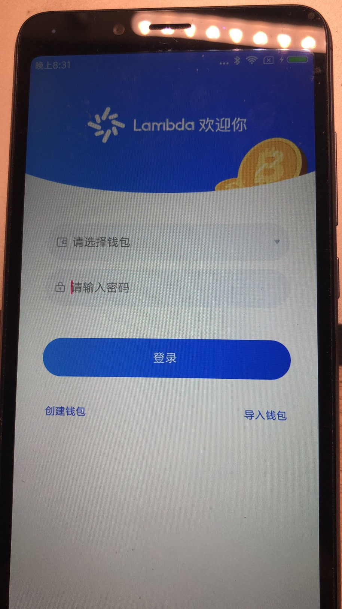

点击创建钱包，进入创建钱包的页面
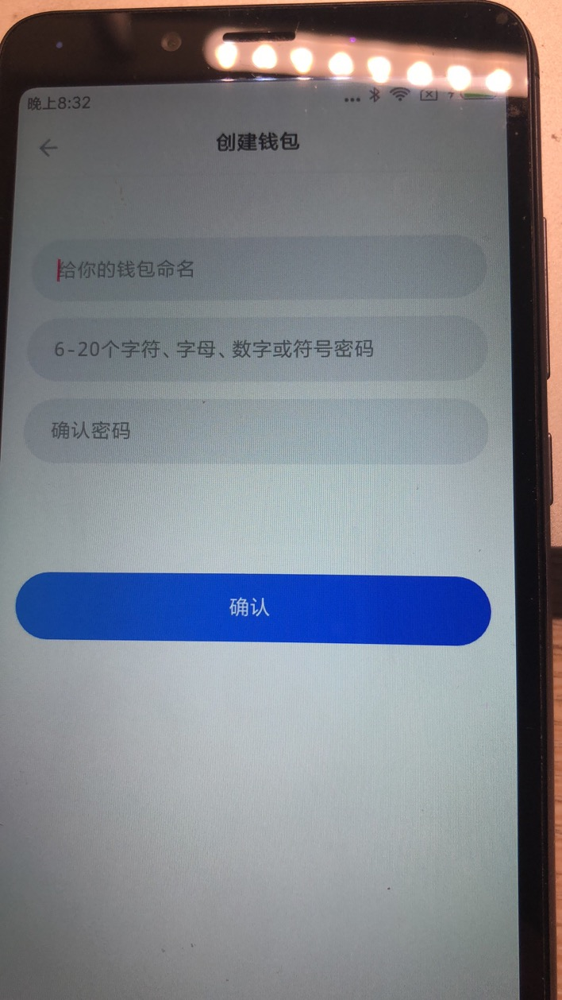

输入钱包的名称、密码，进入查看助记词的页面

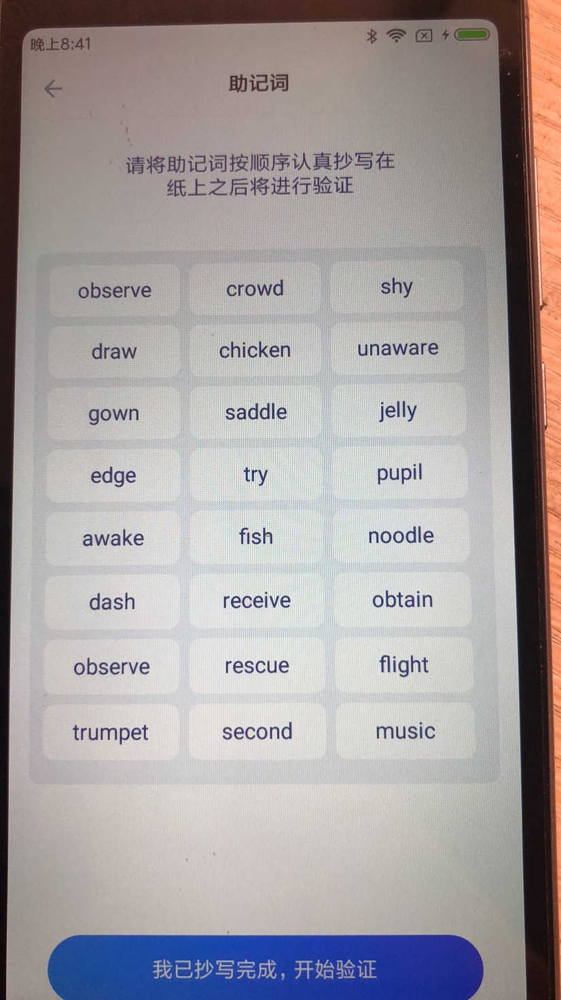

这里需要抄写 下助记词，助记词用来导入和恢复钱包
点击下一步，进入确认助记词页面
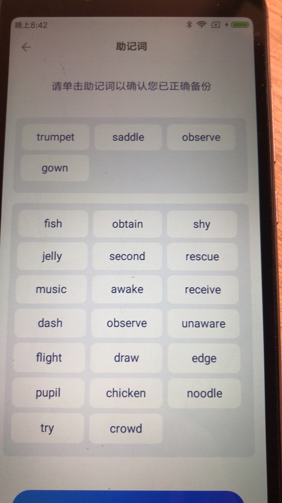

根据抄写的助记词，按照顺序，点击页面上的助记词，
如果抄写错误了，点击返回查看助记词语，如果顺序正确，钱包就创建成功了

## 确认备份助记词正确
在导入钱包时候选择根据助记词导入，可以如果导入成功，助记词的拼写就是正确的，
如果在pc钱包里面导入助记词，导入成功，并且生成的地址和原来的地址一样，也可以用来验证助记词拼写正确

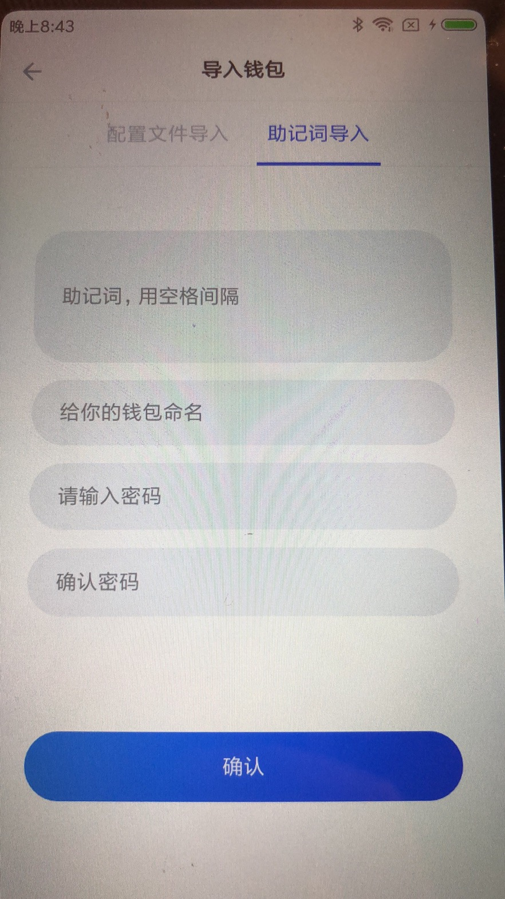

## 质押到验证节点

登陆钱包后 点击地址地址即可复制地址
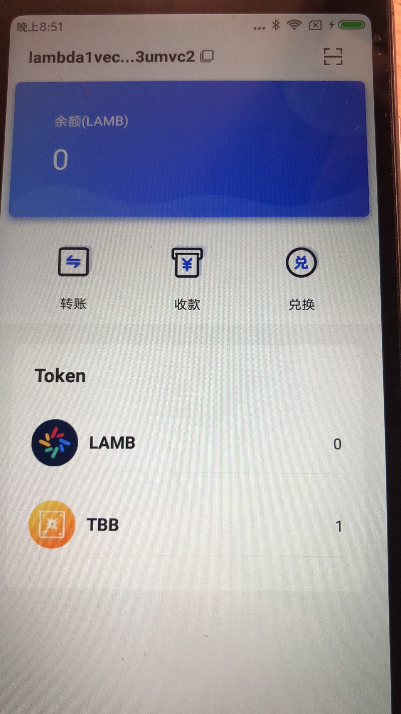
点击底部的菜单的挖矿
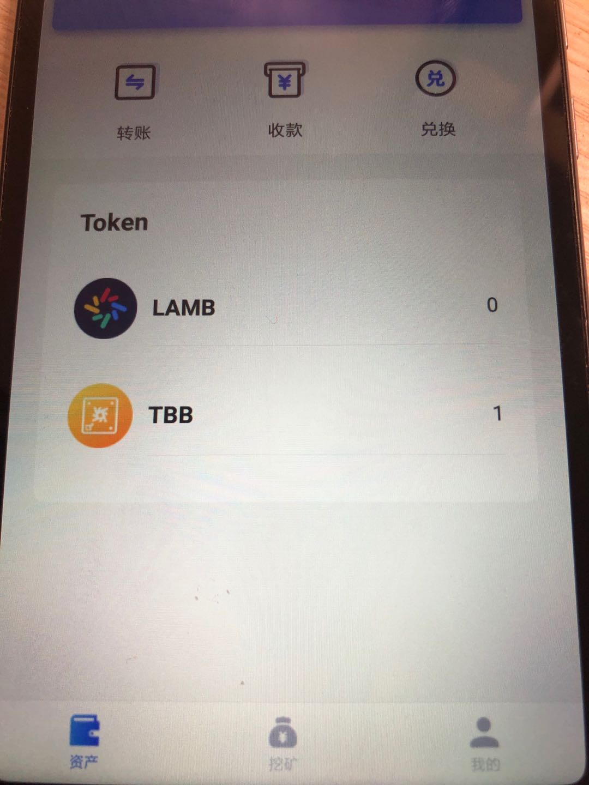
进入验证节点列表
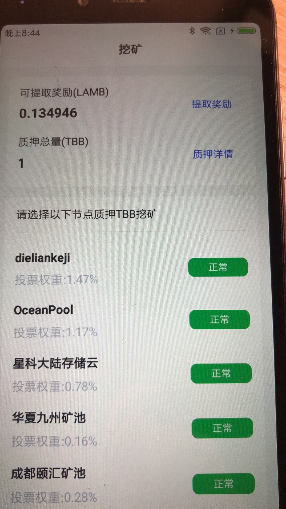
找到要进行质押的验证节点，注意节点的状态是否正常
点击进入节点详情页面

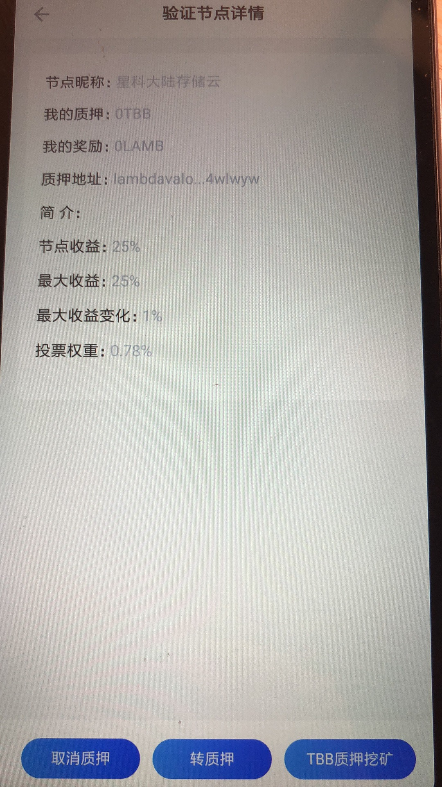

点击底部按钮，TBB挖矿质押，弹出质押对话框
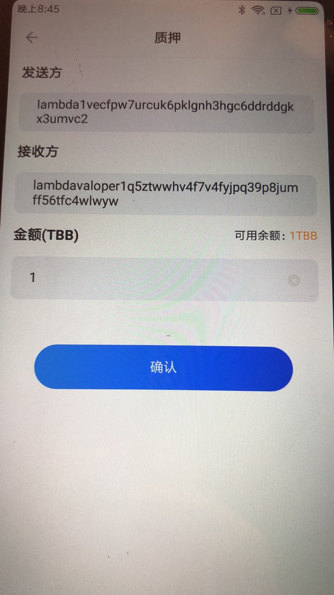

填写质押金额后，点击确定后，在确认手续费的金额即可完成质押

## 提取收益
在挖矿页面点击提取奖励

进入提取奖励详情页面
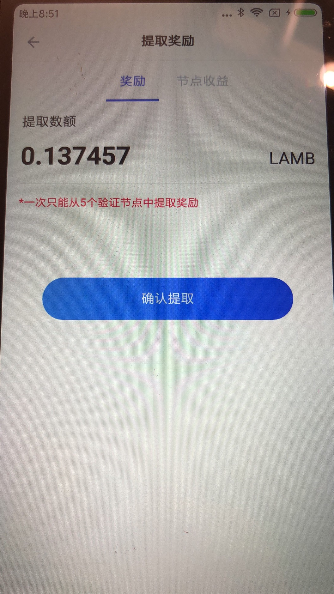
点击确认提取后，在确认手续费即可提取奖励

* [配合使用浏览器查询余额](#配合使用浏览器查询余额)

## 配合使用浏览器查询余额
登陆钱包后，可以先转一点币到当前账户，一会钱包就有记录出现了，点击右上角的地址，复制地址

打开lamba 区块链浏览器 http://explorer.lambdastorage.com/#/
搜索地址，看看地址的余额和最新的交易记录是否和钱包相符
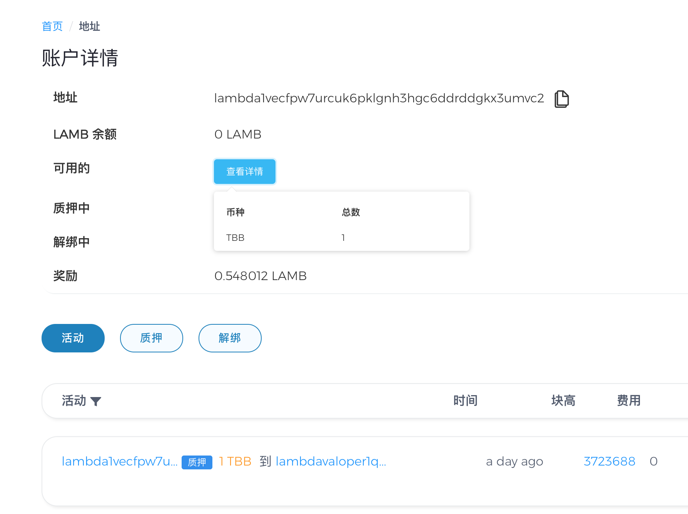

## 转质押
在验证节点详情页面，点击转质押按钮

弹出转质押页面，选择需要转质押的节点和金额，
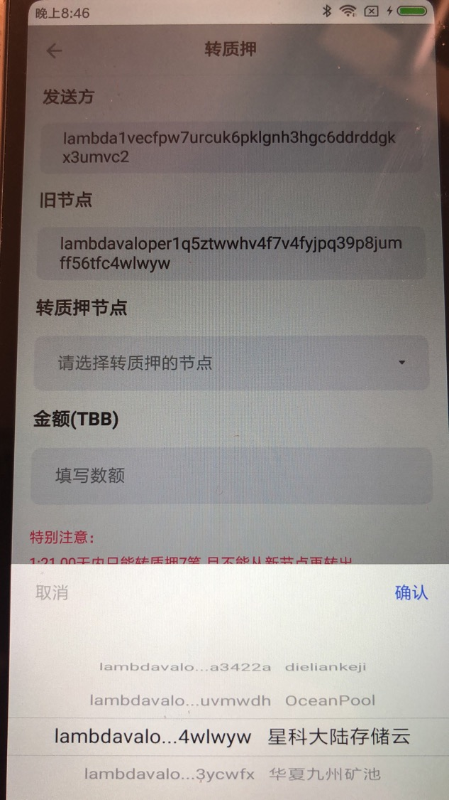
点击确定，在确定手续费即可。
注意：21.00天内只能转质押7笔,且不能从新节点再转出，转质押周期内，原节点被惩罚了，转质押的那部分币，仍会按照惩罚比例进行扣除

## 取消质押

在验证节点详情页面，点击取消质押按钮

弹出取消质押对话框
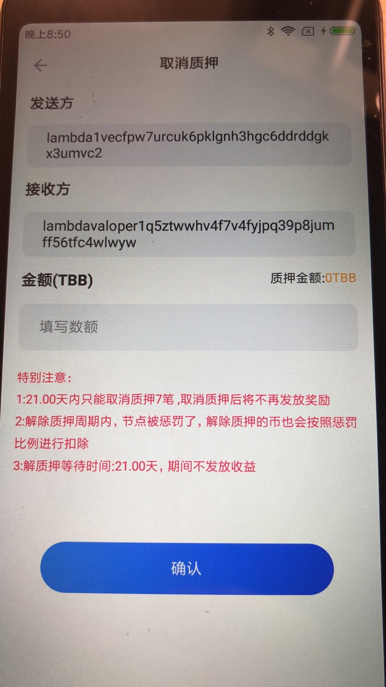
点击确定，在确定手续费即可。
注意：21.00天内只能取消质押7笔 ,取消质押后将不再发放奖励，解除质押周期内，节点被惩罚了，解除质押的币也会按照惩罚比例进行扣除

