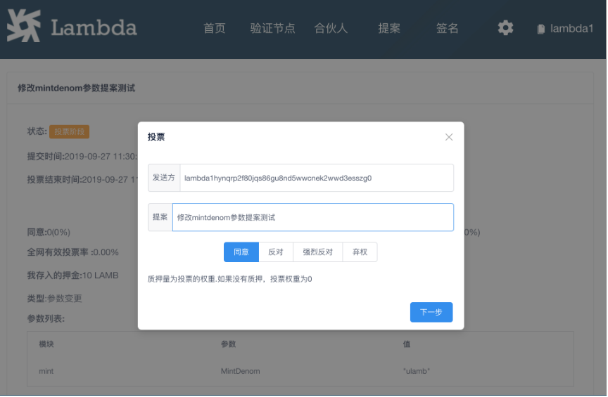

# 社区治理教程

Lambda Chain 是去中心化的网络，因此对网络的治理由社区成员共同参与维护。
社区治理的主要途径是发起提案（proposal），并对提案进行存入押金（deposit）和投票（vote）操作。

## 社区治理流程
### 提案（proposal）
社区治理的方案载体，任何人对于 Lambda Chain 的治理建议，都可以通过提交提案来进行公示和民意表决。目前支持的提案类型有以下几种：
文字类型提案（text）、社区账号转账提案（community-pool-spend）、 修改系统参数提案（param-change）、烧币提案（burn-coins）、系统升级提案（software-upgrade）。
- 文字类型提案（text）：以文字描述来表达自己的治理建议，不会对系统产生直观的修改。
- 社区账号转账提案（community-pool-spend）：社区账号余额的主要来源为块奖励的社区税收部分，可以发起对社区账号余额进行转账的操作，来奖励一些对于社区发展有重大贡献的个人。
- 修改系统参数提案（param-change）：对一些系统的全局参数进行修改，例如代币增发的速率、反质押的周期等。
- 烧币提案（burn-coins）：可以针对黑洞账号（lambda100000000000000000000000000000000xh6npu）里的余额进行烧币的操作。
- 系统升级提案（software-upgrade）：当系统需要进行升级的时候，在按照升级步骤实现准备好了升级程序的前提下，可以通过该类型提案进行平滑升级。

### 存入押金（deposit）
提案是相当昂贵的一个操作，可能会影响整条链的运行。为了防止恶意分子对链进行的攻击，提案存储够一定的代币押金（10000 Lamb），才能进行民意表决。

当提案被提交的那一刻，就会进入到一个众筹押金的阶段，如果在 14 天之内，提案仍然没有存够 10000 Lamb，该提案将会被判定为失败，不会进入投票阶段，并且当前已经众筹到的 Lamb 代币将会被没收转入黑洞账号。

如果在 14 天之内的任何时间点众筹够了 10000 Lamb，提案将会立刻进入投票阶段，所有在系统中有质押的用户都可以对提案进行民意表决。

### 投票（vote）
当提案成功完成众筹，提案会进入到为期 14 天的投票阶段。在此阶段，所有在系统中有质押的用户将可以对提案进行 yes（支持）、no（反对）、no_with_veto（强烈反对）、abstain（弃权） 四选一的投票表决。

节点（validator）、合伙人（partner）、及他们底下的矿工（miner）和质押者都可以根据自己的意向进行表决，如果矿工和质押者不对提案进行投票，他们的节点或合伙人将会代表他们进行表决。

满足以下所有条件，提案判定为通过，并返还众筹到的提案资金：
- 至少占全网 40% 的质押量对提案进行了投票
- 少于 33.4% 的 no_with_veto 票
- 大于 50% (去掉投 abstain 部分的票)投了 yes

未通过的提案，触发以下任一条件，将会被没收众筹到的押金并转入到黑洞账号里：
- 投票数少于全网 40% 质押量
- 大于 33.4% 的 no_with_veto 票

## 命令行操作演示
- [提交提案](./docs/lambdacli/tx/gov/submit-proposal.md)
- [存入押金](./docs/lambdacli/tx/gov/deposit.md)
- [投票](./docs/lambdacli/tx/gov/vote.md)
- [相关查询操作](./docs/lambdacli/query/gov/README.md)

## 钱包众筹与投票操作演示

点击顶部的导航菜单中的提案，即可进入提案列表页面

点击提案的的文字描述部分进入提案详情页面

 
在提案的状态为【存入押金】状态时候，可以给提案存入押金 点击存入押金按钮打开存入押金对话框

  
当押金满足要求后，提案会进入投票状态，点击投票按钮打开投票对话框

投票可以选择 同意 、反对、强烈反对、弃权.如果第一次投票投错了，没关系第二次投票会覆盖第一次投票的结果.  
投票的权重等于质押量，在节点质押和在合伙人质押都是有效质押。如果没有质押过，投票无效。
