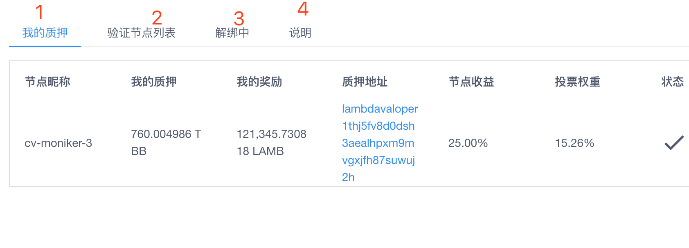
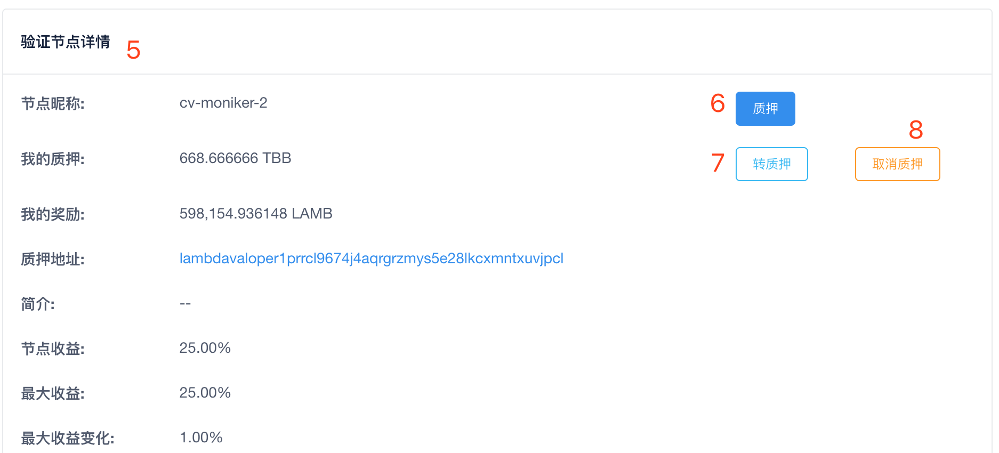
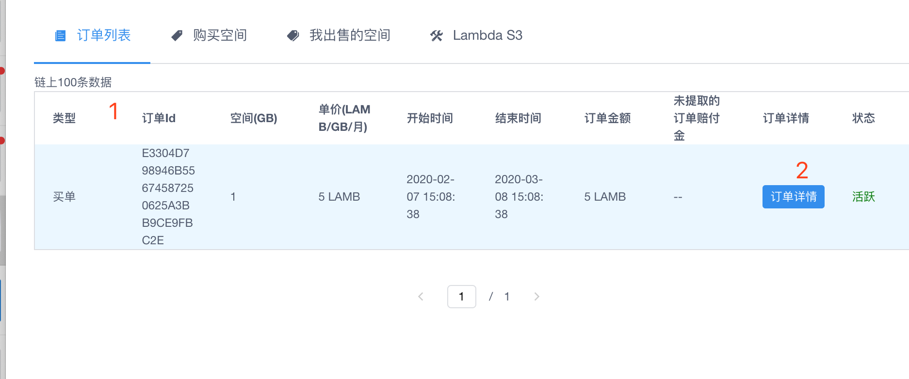
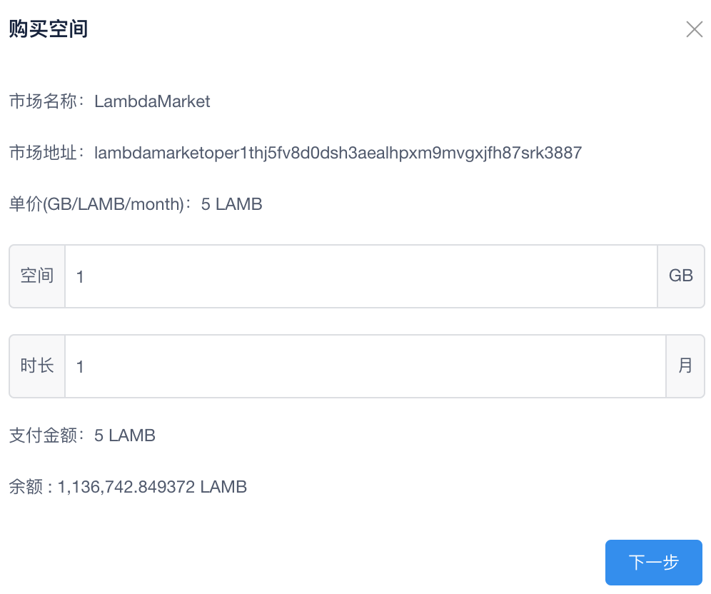
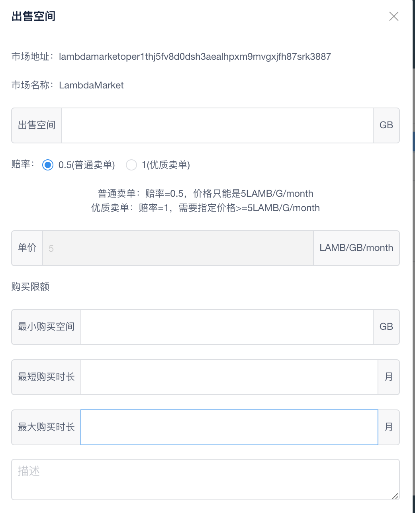

参考钱包版本： [Wallet0.4.40](https://github.com/LambdaIM/launch/releases/tag/Wallet0.4.40)

钱包账户信息文档文档： [钱包账户信息、签名、配置文件说明](Wallet-Hdkey.md) 

主网的钱包服务地址： 39.107.247.86:13659

测试网的钱包服务地址： 47.93.196.236:13659

业务发送说明：发送交易数据可以采用同步或异步方式，同步方式可以获取因为格式等造成的错误信息；异步为async，同步为 block


# 一 首页模块


### 1 lamb余额的数量
```
  账户信息接口 /auth/accounts/${address}
```
例如 [http://47.93.196.236:13659/auth/accounts/lambda1v664znyhztfx3m0v0uua497r5cptg3rd2ytnm8](http://47.93.196.236:13659/auth/accounts/lambda1v664znyhztfx3m0v0uua497r5cptg3rd2ytnm8)
查找coins 中denom 为 ulamb  即可

```
{
	"type": "auth/Account",
	"value": {
		"address": "lambda1v664znyhztfx3m0v0uua497r5cptg3rd2ytnm8",
		"coins": [{
			"denom": "ubtc",
			"amount": "1000000"
		}, {
			"denom": "ulamb",
			"amount": "3000000"
		}],
		"public_key": null,
		"account_number": "502",
		"sequence": "0"
	}
}
```
  
### 2 质押tbb的数量
```
查询个人质押信息的接口 `/staking/delegators/${addr}/delegations`
```
例如 [http://47.93.196.236:13659/staking/delegators/lambda1thj5fv8d0dsh3aealhpxm9mvgxjfh87s224esr/delegations](http://47.93.196.236:13659/staking/delegators/lambda1thj5fv8d0dsh3aealhpxm9mvgxjfh87s224esr/delegations)
```
[
  {
    "delegator_address": "lambda1thj5fv8d0dsh3aealhpxm9mvgxjfh87s224esr",
    "validator_address": "lambdavaloper1thj5fv8d0dsh3aealhpxm9mvgxjfh87suwuj2h",
    "shares": "767676003.820176389957445490"
  }
]
```
这里需要注意shares 表示质押量占的份数，如果要换算为质押量TBB,需要进行计算
```
shares*(tokens/delegator_shares)
节点的信息中包含delegator_shares 和 tokens
```
通过节点列表接口可以获取到这两个值
这里在计算的时候建议使用bignumber,


读取节点列表

```
/staking/validators?status=unbonding   //禁闭中
/staking/validators?status=bonded      //质押中
/staking/validators?status=unbonded     //未解禁
```
unbonding是反质押中，或被禁闭中    unbonded是反质押完成 或 被禁的节点过了21天还没解禁
```
[
{
    "operator_address": "lambdavaloper1prrcl9674j4aqrgrzmys5e28lkcxmntxuvjpcl",
    "consensus_pubkey": "lambdavalconspub1zcjduepqp7ccjeshlpslrzjj75je5kn6dhtq8l5nnl6h5jtavgsf5tyekfsqe4mnh9",
    "jailed": false,
    "status": 2,
    "tokens": "2680066666",
    "delegator_shares": "2680066666.000000000000000000",
    "description": {
      "moniker": "cv-moniker-2",
      "identity": "",
      "website": "",
      "details": ""
    },
    "unbonding_height": "0",
    "unbonding_time": "1970-01-01T00:00:00Z",
    "commission": {
      "rate": "0.250000000000000000",
      "max_rate": "0.250000000000000000",
      "max_change_rate": "0.010000000000000000",
      "update_time": "2019-12-25T16:56:40.666534478Z"
    },
    "min_self_delegation": "666666666"
  },
]
```

### 3 质押tbb获得奖励的数量
```
1 获取用户的质押列表接口
  `/staking/delegators/${addr}/delegations`
2 一个节点下质押获取的奖励的数量接口
`/distribution/delegators/${delegatorAddr}/rewards/${validatorAddr}`
  
```
例如  [http://47.93.196.236:13659/distribution/delegators/lambda163q4m634nq8les4nuvdvz49tk6aeh926t0ccsc/rewards/lambdavaloper1prrcl9674j4aqrgrzmys5e28lkcxmntxuvjpcl](http://47.93.196.236:13659/distribution/delegators/lambda163q4m634nq8les4nuvdvz49tk6aeh926t0ccsc/rewards/lambdavaloper1prrcl9674j4aqrgrzmys5e28lkcxmntxuvjpcl)
```
[
  {
    "denom": "ulamb",
    "amount": "3514296927.123515563816500000"
  }
]
```
这里需要注意传入地址的格式
${delegatorAddr}  为用户的lamb地址

${validatorAddr} 为验证节点的操作地址 操作地址的前缀为 lambdavaloper

地址之间转换 见[钱包账户信息、签名、配置文件说明](Wallet-Hdkey.md)


### 4 节点收益的数量
获取节点收益的接口

```
`/distribution/validators/${validatorAddr}`
```
例如 [http://47.93.196.236:13659/distribution/validators/lambdavaloper1prrcl9674j4aqrgrzmys5e28lkcxmntxuvjpcl](http://47.93.196.236:13659/distribution/validators/lambdavaloper1prrcl9674j4aqrgrzmys5e28lkcxmntxuvjpcl)
返回结果

```
{
	"operator_address": "lambda1prrcl9674j4aqrgrzmys5e28lkcxmntx2gm2zt",
	"self_bond_rewards": [{  //自己质押的收益
		"denom": "ulamb",
		"amount": "1318824629026.957070122504282575"
	}],
	"val_commission": [{    //收取矿工的佣金
		"denom": "ulamb",
		"amount": "827774754064.482428092893265856"
	}]
}
```
 目前钱包里节点收益 的取值为val_commission 的属性

### 5 存储挖矿收益的数量
获取存储挖矿的收益 接口

```
`/distribution/miners/${MinerAddress}`
```
这里的${MinerAddress} 为矿工操作格式的地址
地址之间转换 见[钱包账户信息、签名、配置文件说明](Wallet-Hdkey.md)


### 6 获取最新交易列表、交易详情
```
/txs?sender=${addr}&page=1000000            获取最新发送的交易
/txs?recipient=${addr}&page=1000000         获取最新接受的交易
```
根据交易哈希获取交易详情
```
`/txs/${hash}`
```


### 7 获取用户资产列表
  1 获取用户有哪些资产
```
/auth/accounts/${address}
```
```
{
	"type": "auth/Account",
	"value": {
		"address": "lambda1v664znyhztfx3m0v0uua497r5cptg3rd2ytnm8",
		"coins": [{
			"denom": "ubtc",
			"amount": "1000000"
		}, {
			"denom": "ulamb",
			"amount": "3000000"
		}],
		"public_key": null,
		"account_number": "502",
		"sequence": "0"
	}
}
```
2 获取区块链上资产的列表
```
 /asset/all
```
```
[
  {
    "address": "lambda1a83p8s9gs5hua09xn5ktmahepst3vzg92wkp4e",
    "asset": {
      "denom": "ubtc",   //资产名称
      "amount": "90000000000000000"
    },
    "Token": {
      "denom": "ulamb",
      "amount": "1000000000000"
    },
    "name": "BTC Coin",
    "mintable": true,
    "curr_supply": {
      "denom": "ubtc",
      "amount": "90000000000000000"
    },
    "lock_supply": {
      "denom": "ubtc",
      "amount": "0"
    }
  },
  {
    "address": "lambda1a83p8s9gs5hua09xn5ktmahepst3vzg92wkp4e",
    "asset": {
      "denom": "uhpt",
      "amount": "90000000000000000"
    },
    "Token": {
      "denom": "ulamb",
      "amount": "1000000000000"
    },
    "name": "HPT Coin",
    "mintable": true,
    "curr_supply": {
      "denom": "uhpt",
      "amount": "90000000000000000"
    },
    "lock_supply": {
      "denom": "uhpt",
      "amount": "0"
    }
  }
]
```


### 8 发起交易lamb和获取gas
   ① 模拟交易获取gas

      模拟接口获取gas

```
/bank/accounts/${senderAddress}/transfers
类型 post
发送数据类型 json
```
钱包里面默认的gas的价格为 2.5e-6
交易的费用为 gas*gas的价格

【转账交易的例子 post 的内容】

```
{
	"base_req": {
		"sequence": "208",
		"from": "lambda163q4m634nq8les4nuvdvz49tk6ae**********",
		"account_number": "6",
		"chain_id": "lambda-chain-test4.0",
		"simulate": true,
		"memo": ""
	},
	"amount": [{
		"amount": "1000000",
		"denom": "ulamb"
	}],
	"from_address": "lambda163q4m634nq8les4nuvdvz49tk6ae**********",
	"to_address": "lambda16cheh6j34ncyunwgfkq2940cs8222jka0fsp4k"
}
```
返回结果 
```
  {"gas_estimate":"28077"}
```


   ② 数据签名

用于进行签名的数据结构

```
{
	"account_number": "1",  //通过用户信息获取
	"chain_id": "lambda-chain-test2.5", //链的版本号 通过最新的区块信息获取 
	"fee": {//手续费
		"amount": [{
			"amount": "101745",
			"denom": "ulamb" 
		}],
		"gas": "40698"  //gas
	},
	"memo": "", //备注
	"msgs": [{
		"type": "cosmos-sdk/MsgSend", //交易类型
		"value": {
			"amount": [{
				"amount": "1000000",   //交易的数量
				"denom": "ulamb"    //交易的代币类型
			}],
			"from_address": "lambda1prrcl9674j4aqrgrzmys5e28lkcxmntx2gm2zt",  //发送地址
			"to_address": "lambda1hynqrp2f80jqs86gu8nd5wwcnek2wwd3esszg0"   //接受地址
		}
	}],
	"sequence": "125"  //通过获取用户信息接口获取
}
```
每次发起交易前，均要通过账户信息接口获取最新的sequence

chain_id 可以通过 节点信息接口  `/node_info` 获取


   ③ 发送数据

```
{
	"tx": {
		"msg": [{
			"type": "cosmos-sdk/MsgSend",
			"value": {
				"amount": [{
					"amount": "1000000",
					"denom": "ulamb"
				}],
				"from_address": "lambda1prrcl9674j4aqrgrzmys5e28lkcxmntx2gm2zt",
				"to_address": "lambda1hynqrp2f80jqs86gu8nd5wwcnek2wwd3esszg0"
			}
		}],
		"fee": {
			"amount": [{
				"amount": "101745",
				"denom": "ulamb"
			}],
			"gas": "40698"
		},
		"signatures": [{  
			"signature": //签名的结果
"fa9bUlNRA3qa9PEYR2py6CgpQbbqVsuKhJRowMdlf90byj7M/2B1YQsu6EPAk1V/tLkKiNwEadkAKNFUxZngGA==",
			"pub_key": {
				"type": "tendermint/PubKeySecp256k1",
				"value": "AjmQ01Z+IoHuKLdPaFzV6IJQB88ahW2qv2rEw2H4B5dq"  //公钥
			}
		}],
		"memo": ""
	},
	"mode": "async"    发送交易的方式async 为异步，block 为同步
}
```

### 9 提取质押TBB的奖励
提取奖励：提取奖励不需要传入数值，只需要传入 节点操作地址和质押人地址即可

发送交易的接口：同交易接口


签名的数据结构

```
{
	"account_number": "1",
	"chain_id": "lambda-chain-test2.5",
	"fee": {
		"amount": [{
			"amount": "635848",
			"denom": "ulamb"
		}],
		"gas": "254339"
	},
	"memo": "",
	"msgs": [{
		"type": "cosmos-sdk/MsgWithdrawDelegationReward",
		"value": {
			"delegator_address": "lambda1prrcl9674j4aqrgrzmys5e28lkcxmntx2gm2zt",  //质押人地址
			"validator_address": "lambdavaloper1prrcl9674j4aqrgrzmys5e28lkcxmntxuvjpcl" //节点地址  
		}
	}, {
		"type": "cosmos-sdk/MsgWithdrawDelegationReward",
		"value": {
			"delegator_address": "lambda1prrcl9674j4aqrgrzmys5e28lkcxmntx2gm2zt",
			"validator_address": "lambdavaloper1r340rrv9fs95gqy5087e2mtz82vvwrglt6amx3"
		}
	}, {
		"type": "cosmos-sdk/MsgWithdrawDelegationReward",
		"value": {
			"delegator_address": "lambda1prrcl9674j4aqrgrzmys5e28lkcxmntx2gm2zt",
			"validator_address": "lambdavaloper1thj5fv8d0dsh3aealhpxm9mvgxjfh87suwuj2h"
		}
	}],
	"sequence": "127"
}
```
发送交易的数据结构
```
{
	"tx": {
		"msg": [{
			"type": "cosmos-sdk/MsgWithdrawDelegationReward",
			"value": {
				"delegator_address": "lambda1prrcl9674j4aqrgrzmys5e28lkcxmntx2gm2zt",
				"validator_address": "lambdavaloper1prrcl9674j4aqrgrzmys5e28lkcxmntxuvjpcl"
			}
		}, {
			"type": "cosmos-sdk/MsgWithdrawDelegationReward",
			"value": {
				"delegator_address": "lambda1prrcl9674j4aqrgrzmys5e28lkcxmntx2gm2zt",
				"validator_address": "lambdavaloper1r340rrv9fs95gqy5087e2mtz82vvwrglt6amx3"
			}
		}, {
			"type": "cosmos-sdk/MsgWithdrawDelegationReward",
			"value": {
				"delegator_address": "lambda1prrcl9674j4aqrgrzmys5e28lkcxmntx2gm2zt",
				"validator_address": "lambdavaloper1thj5fv8d0dsh3aealhpxm9mvgxjfh87suwuj2h"
			}
		}],
		"fee": {
			"amount": [{
				"amount": "635848",
				"denom": "ulamb"
			}],
			"gas": "254339"
		},
		"signatures": [{
			"signature": "CNxU2hyIL1Az8Mb+Btt3APP1f476Q+Z/bTzmpsTQV2l3Od5TLfTlgS4hJkhLsCHlzXbCCJlhDz9d2OK3IvupCQ==",
			"pub_key": {
				"type": "tendermint/PubKeySecp256k1",
				"value": "AjmQ01Z+IoHuKLdPaFzV6IJQB88ahW2qv2rEw2H4B5dq"
			}
		}],
		"memo": ""
	},
	"mode": "async"
}
```
### 10 提取节点收益
签名数据格式

```
{
	"account_number": "1",
	"chain_id": "lambda-chain-test2.5",
	"fee": {
		"amount": [{
			"amount": "636128",
			"denom": "ulamb"
		}],
		"gas": "254451"
	},
	"memo": "",
	"msgs": [{
		"type": "cosmos-sdk/MsgWithdrawValidatorCommission",
		"value": {
			"validator_address": "lambdavaloper1prrcl9674j4aqrgrzmys5e28lkcxmntxuvjpcl"   //节点的操作地址 
		}
	}],
	"sequence": "128"
}
```
发送数据格式
```
{
	"tx": {
		"msg": [{
			"type": "cosmos-sdk/MsgWithdrawValidatorCommission",
			"value": {
				"validator_address": "lambdavaloper1prrcl9674j4aqrgrzmys5e28lkcxmntxuvjpcl"
			}
		}],
		"fee": {
			"amount": [{
				"amount": "636128",
				"denom": "ulamb"
			}],
			"gas": "254451"
		},
		"signatures": [{
			"signature": "iCa63qOUVNsxIsynOuPtrZRtqWYz5IWGz624Vzn2nBhOEadmsLm87Ms4U2W/V6o74e+6OmkKIERkFFJngU7ABw==",
			"pub_key": {
				"type": "tendermint/PubKeySecp256k1",
				"value": "AjmQ01Z+IoHuKLdPaFzV6IJQB88ahW2qv2rEw2H4B5dq"
			}
		}],
		"memo": ""
	},
	"mode": "async"
}
```


### 11 提取存储挖矿奖励
接口同交易接口

签名前数据

```
{
	"account_number": "0",
	"chain_id": "lambda-chain-test4.3",
	"fee": {
		"amount": [],
		"gas": "2115"
	},
	"memo": "",
	"msgs": [{
		"type": "lambda/MsgWithdrawMinerRewards",
		"value": {
			"miner_address": "lambdamineroper12fldnycgpevw4gthq9w0zcfetpa9sn4d92z92l" //矿工操作地址
		}
	}],
	"sequence": "0"
}
```
发送数据
```
{
	"tx": {
		"msg": [{
			"type": "lambda/MsgWithdrawMinerRewards",
			"value": {
				"miner_address": "lambdamineroper12fldnycgpevw4gthq9w0zcfetpa9sn4d92z92l"
			}
		}],
		"fee": {
			"amount": [],
			"gas": "2115"
		},
		"signatures": [{
			"signature": "7iLVRp23QIIRkiRQel2lnQ2HY35kFEviFjS48BJrj55luPItQ/L2sM4KvdddGOrms+ZK/BIJG7RXEm7tt4WsMg==",
			"pub_key": {
				"type": "tendermint/PubKeySecp256k1",
				"value": "A208sFTFL728fK4ctkdPR6Z+AV8cGn+efQ0nKdVCbq7C"
			}
		}],
		"memo": ""
	},
	"mode": "async"
}
```
### 12 lamb和tbb之前兑换
规则 
① 3000个lamb 兑换1个tbb 且必须是整数
②一账户通过lamb兑换的tbb是可以再兑换为lamb的，但是转账的tbb不能兑换为lamb

接口同交易接口

lamb转tbb

签名前的数据

```
{
	"account_number": "6",
	"chain_id": "lambda-chain-test4.0",
	"fee": {
		"amount": [{
			"amount": "140798",
			"denom": "ulamb"
		}],
		"gas": "56319"
	},
	"memo": "",
	"msgs": [{
		"type": "lambda/MsgAssetPledge",  交易的类型
		"value": {
			"address": "lambda163q4m634nq8les4nuvdvz49tk6aeh926t0ccsc", 发送人地址
			"asset": {
				"amount": "1000000",
				"denom": "utbb"
			},
			"token": {
				"amount": "3000000000",    lamb的数量
				"denom": "ulamb"
			}
		}
	}],
	"sequence": "216"
}
```
发送的数据
```
{
	"tx": {
		"msg": [{
			"type": "lambda/MsgAssetPledge",
			"value": {
				"address": "lambda163q4m634nq8les4nuvdvz49tk6aeh926t0ccsc",
				"asset": {
					"amount": "1000000",
					"denom": "utbb"
				},
				"token": {
					"amount": "3000000000",
					"denom": "ulamb"
				}
			}
		}],
		"fee": {
			"amount": [{
				"amount": "140798",
				"denom": "ulamb"
			}],
			"gas": "56319"
		},
		"signatures": [{
			"signature": "0lmFd0cpyBTxWpgkvOUT7VfPIr7UY0sD8mlQEneJaA1upRlP9H/caHYA6Fikp0+un/GxeBRahXKuFvrsEFuXuQ==",
			"pub_key": {
				"type": "tendermint/PubKeySecp256k1",
				"value": "A8XABxcKi0bX6P/K7CaifPJvfk/pSrf4E7mBM7yV89ZR"
			}
		}],
		"memo": ""
	},
	"mode": "block"
}
```
tbb转lamb
签名前的数据

```
{
	"account_number": "6",
	"chain_id": "lambda-chain-test4.0",
	"fee": {
		"amount": [{
			"amount": "140798",
			"denom": "ulamb"
		}],
		"gas": "56319"
	},
	"memo": "",
	"msgs": [{
		"type": "lambda/MsgAssetDrop",  交易类型
		"value": {
			"address": "lambda163q4m634nq8les4nuvdvz49tk6aeh926t0ccsc",  发送人的地址
			"asset": {
				"amount": "1000000",  tbb的数量
				"denom": "utbb"
			},
			"token": {
				"amount": "3000000000", lamb的数量
				"denom": "ulamb"
			}
		}
	}],
	"sequence": "217"
}
```
发送的数据
```
{
	"tx": {
		"msg": [{
			"type": "lambda/MsgAssetDrop",
			"value": {
				"address": "lambda163q4m634nq8les4nuvdvz49tk6aeh926t0ccsc",
				"asset": {
					"amount": "1000000",
					"denom": "utbb"
				},
				"token": {
					"amount": "3000000000",
					"denom": "ulamb"
				}
			}
		}],
		"fee": {
			"amount": [{
				"amount": "140798",
				"denom": "ulamb"
			}],
			"gas": "56319"
		},
		"signatures": [{
			"signature": "6tKf/brt/llh4XgiwBS65aDMvt7cV13pQBN2ph/nJdcB44dPxlQ0LGopZ76un+AH+RJYa/NCPtDTW4M7viPaoA==",
			"pub_key": {
				"type": "tendermint/PubKeySecp256k1",
				"value": "A8XABxcKi0bX6P/K7CaifPJvfk/pSrf4E7mBM7yV89ZR"
			}
		}],
		"memo": ""
	},
	"mode": "block"
```
### 13 其他资产的交易 tbb 等
  其他资产交易只需要将交易ulamb改为资产的代码 例如utbb


 

### 14 获取链接节点的信息和区块链的最新块高
获取最新的区块信息 接口  `/blocks/latest`

获取链接的节点的 节点信息接口  `/node_info`

# 二 我的质押与验证节点模块


### 1 我的质押列表
  需要的接口有

账户的质押信息接口

```
`/staking/delegators/${addr}/delegations`
```
查询在节点质押的奖励
```
/distribution/delegators/${addr}/rewards
```
验证节点列表接口
读取节点列表

```
/staking/validators?status=unbonding   //禁闭中
/staking/validators?status=bonded      //质押中
/staking/validators?status=unbonded     //未解禁
```
unbonding是反质押中，或被禁闭中    unbonded是反质押完成 或 被禁的节点过了21天还没解禁
计算我 的质押量需要注意

shares 表示质押量占的份数，如果要换算为质押量TBB,需要进行计算

```
shares*(delegator_shares/tokens)
节点的信息中包含delegator_shares 和 tokens
```
通过节点列表接口可以获取到这两个值
这里在计算的时候建议使用bignumber,

### 2 验证节点列表
验证节点列表接口

读取节点列表

```
/staking/validators?status=unbonding   //禁闭中
/staking/validators?status=bonded      //质押中
/staking/validators?status=unbonded     //未解禁
```
unbonding是反质押中，或被禁闭中    
unbonded是反质押完成 或 被禁的节点过了21天还没解禁

获取全网质押总量接口

```
 `/staking/pool`
```
```
{
  "not_bonded_tokens": "999386446677",
  "bonded_tokens": "2817286659" 质押的代币量 
}
```
### 3 解绑列表
接口

```
/staking/delegators/lambda1prrcl9674j4aqrgrzmys5e28lkcxmntx2gm2zt/${addr}
```
数据
```
[
  {
    "delegator_address": "lambda1prrcl9674j4aqrgrzmys5e28lkcxmntx2gm2zt",
    "validator_address": "lambdavaloper1r340rrv9fs95gqy5087e2mtz82vvwrglt6amx3",
    "entries": [
      {
        "creation_height": "584551",
        "completion_time": "2020-02-10T03:54:21.307661732Z",
        "initial_balance": "1000000",//解绑的金额
        "balance": "1000000"
      }
    ]
  }
]
```
### 4 质押说明
接口

```
/staking/parameters
```
数据
```
{
  "unbonding_time": "259200000000000", 解绑需要等待的时间
  "max_validators": 100, 最大节点个数
  "max_entries": 7, 
  "bond_denom": "utbb", 质押的代币类型
  "supply_denom": "ulamb",
  "consensus_validator_min_self_delegation": "666666666",
  "partner_validator_min_self_delegation": "33333333",
  "consensus_validator_min_delegation": "1000000",
  "partner_validator_min_delegation": "100000",
  "consensus_validator_fixed_commission_rate": "0.250000000000000000",
  "partner_validator_fixed_commission_rate": "0.250000000000000000"
}
```




### 5 验证节点详情
 验证节点详情

```
/staking/validators/${addr}
```
数据
```
{
  "operator_address": "lambdavaloper1prrcl9674j4aqrgrzmys5e28lkcxmntxuvjpcl",
  "consensus_pubkey": "lambdavalconspub1zcjduepqp7ccjeshlpslrzjj75je5kn6dhtq8l5nnl6h5jtavgsf5tyekfsqe4mnh9",
  "jailed": false,
  "status": 2,
  "tokens": "2986066666",
  "delegator_shares": "2986066666.000000000000000000",
  "description": {
    "moniker": "cv-moniker-2",
    "identity": "",
    "website": "",
    "details": ""
  },
  "unbonding_height": "0",
  "unbonding_time": "1970-01-01T00:00:00Z",
  "commission": {
    "rate": "0.250000000000000000",
    "max_rate": "0.250000000000000000",
    "max_change_rate": "0.010000000000000000",
    "update_time": "2019-12-25T16:56:40.666534478Z"
  },
  "min_self_delegation": "666666666"
}
```
当前节点，我的质押量
```
/staking/delegators/${addr}
```
返回的结果为质押列表，在列表中根据节点地址查找，即可找到在当前节点质押量

当前节点，我的奖励

接口

```
/distribution/delegators/${addr}/rewards
```
数据
```
[
  {
    "denom": "ulamb",
    "amount": "598405476034.642733223256195258"
  }
]
```
###  6 质押
发送质押交易数据的接口同交易接口

获取gas的接口同交易接口

签名数据的结构

```
{
	"account_number": "1",
	"chain_id": "lambda-chain-test2.5",
	"fee": {
		"amount": [{
			"amount": "421935",
			"denom": "ulamb"
		}],
		"gas": "168774"
	},
	"memo": "",
	"msgs": [{
		"type": "lambda/MsgDelegate",
		"value": {
			"amount": {
				"amount": "1000000",  //质押的数量
				"denom": "utbb"  //质押的代币类型
			},
			"delegator_address": "lambda1prrcl9674j4aqrgrzmys5e28lkcxmntx2gm2zt",    质押人的地址
			"validator_address": "lambdavaloper1prrcl9674j4aqrgrzmys5e28lkcxmntxuvjpcl",  //验证节点的操作地址
			"validator_type": 1    类型1 表示验证节点 0表示合伙人
		}
	}],
	"sequence": "126"
}
```
发送数据的结构
```
{
	"tx": {
		"msg": [{
			"type": "lambda/MsgDelegate",
			"value": {
				"amount": {
					"amount": "1000000",
					"denom": "utbb"
				},
				"delegator_address": "lambda1prrcl9674j4aqrgrzmys5e28lkcxmntx2gm2zt",
				"validator_address": "lambdavaloper1prrcl9674j4aqrgrzmys5e28lkcxmntxuvjpcl",
				"validator_type": 1
			}
		}],
		"fee": {
			"amount": [{
				"amount": "421935",
				"denom": "ulamb"
			}],
			"gas": "168774"
		},
		"signatures": [{
			"signature": "xKJeVWVPH+NrOd+NogBesdYUSM3a8PJ/MiUxHvVpQDpok6WZ4yd0SHTc0/choPvT81tXHFhg9Lrp/tSTr3sFOA==",
			"pub_key": {
				"type": "tendermint/PubKeySecp256k1",
				"value": "AjmQ01Z+IoHuKLdPaFzV6IJQB88ahW2qv2rEw2H4B5dq"
			}
		}],
		"memo": ""
	},
	"mode": "async"
}
```
### 7 转质押
发送交易数据的接口同交易接口

获取gas的接口同交易接口

转质押的签名数据结构

```
{
	"account_number": "6",
	"chain_id": "lambda-chain-test4.0",
	"fee": {
		"amount": [{
			"amount": "575325",
			"denom": "ulamb"
		}],
		"gas": "230130"
	},
	"memo": "",
	"msgs": [{
		"type": "lambda/MsgBeginRedelegate",
		"value": {
			"amount": {
				"amount": "1000000",  转质押的数量
				"denom": "utbb"
			},
			"delegator_address": "lambda163q4m634nq8les4nuvdvz49tk6ae**********",  质押人的地址
			"validator_dst_address": "lambdavaloper1r340rrv9fs95gqy5087e2mtz82vvwrglt6amx3", 新的质押地址
			"validator_src_address": "lambdavaloper1prrcl9674j4aqrgrzmys5e28lkcxmntxuvjpcl",  旧的质押地址
			"validator_type": 1  节点类型  验证节点为1 合伙人为0
		}
	}],
	"sequence": "208"
}
```
转质押发送数据的结构

```
{
	"tx": {
		"msg": [{
			"type": "lambda/MsgBeginRedelegate",
			"value": {
				"amount": {
					"amount": "1000000",
					"denom": "utbb"
				},
				"delegator_address": "lambda163q4m634nq8les4nuvdvz49tk6ae**********",
				"validator_dst_address": "lambdavaloper1r340rrv9fs95gqy5087e2mtz82vvwrglt6amx3",
				"validator_src_address": "lambdavaloper1prrcl9674j4aqrgrzmys5e28lkcxmntxuvjpcl",
				"validator_type": 1
			}
		}],
		"fee": {
			"amount": [{
				"amount": "575325",
				"denom": "ulamb"
			}],
			"gas": "230130"
		},
		"signatures": [{
			"signature": "5Ejsk1J1bwBU9eJWsquhKOq5tW081W7CumAGbfaf3dguWm4cVE/wb29zzb0VLYNErx2jo6Ky9TQfs3Ib7uXy7g==",
			"pub_key": {
				"type": "tendermint/PubKeySecp256k1",
				"value": "A8XABxcKi0bX6P/K7CaifPJvfk/pSrf4E7mBM7yV89ZR"
			}
		}],
		"memo": ""
	},
	"mode": "block"
}
```
### 8 取消质押
发送交易数据的接口同交易接口

获取gas的接口同交易接口

签名的数据结构

```
{
	"account_number": "6",
	"chain_id": "lambda-chain-test4.0",
	"fee": {
		"amount": [{
			"amount": "404805",
			"denom": "ulamb"
		}],
		"gas": "161922"
	},
	"memo": "",
	"msgs": [{
		"type": "lambda/MsgUndelegate",
		"value": {
			"amount": {
				"amount": "1000000",//取消质押的数量
				"denom": "utbb"
			},
			"delegator_address": "lambda163q4m634nq8les4nuvdvz49tk6ae**********",//操作人的地址
			"validator_address": "lambdavaloper1prrcl9674j4aqrgrzmys5e28lkcxmntxuvjpcl",//节点的操作地址
			"validator_type": 1  节点类型 验证节点为1 合伙人为0
		}
	}],
	"sequence": "209"
}
```
发送数据的的数据结构
```
{
	"tx": {
		"msg": [{
			"type": "lambda/MsgUndelegate",
			"value": {
				"amount": {
					"amount": "1000000",  
					"denom": "utbb"
				},
				"delegator_address": "lambda163q4m634nq8les4nuvdvz49tk6ae**********",  
				"validator_address": "lambdavaloper1prrcl9674j4aqrgrzmys5e28lkcxmntxuvjpcl",  
				"validator_type": 1    
			}
		}],
		"fee": {
			"amount": [{
				"amount": "404805",
				"denom": "ulamb"
			}],
			"gas": "161922"
		},
		"signatures": [{
			"signature": "dwmnrm6iAQzOv2GfpyzQYcY0zyfqMnCKzPFhSkvGjx5hyEbNYcWKRknahF1X6N1zciGx4ClhuhpXbau96rfsvQ==",
			"pub_key": {
				"type": "tendermint/PubKeySecp256k1",
				"value": "A8XABxcKi0bX6P/K7CaifPJvfk/pSrf4E7mBM7yV89ZR"
			}
		}],
		"memo": ""
	},
	"mode": "block"
}
```
# 三 提案与投票
### 提案列表
接口 
```
/gov/proposals
```

返回结果

```
[{
	"content": {
		"type": "cosmos-sdk/TextProposal",  //提案的类型
		"value": {
			"title": "文本提案中文换行测试",    //标题
			"description": "诺贝尔化学奖揭晓。"  //提案内容
		}
	},
	"id": "1",  //提案id
	"proposal_status": "Rejected",  提案状态
	"final_tally_result": {
		"yes": "90000",  同意的票数
		"abstain": "16190009", 弃权的票数
		"no": "0",反对的票数
		"no_with_veto": "0" 强烈反对的票数
	},
	"submit_time": "2019-10-10T07:21:22.988264879Z", 提交时间
	"deposit_end_time": "2019-10-12T07:21:22.988264879Z",存款结束的时间
	"total_deposit": [{    存钱的数量
		"denom": "ulamb",
		"amount": "11023000000"
	}],
	"voting_start_time": "2019-10-11T03:48:59.199943178Z",  投票开始时间 
	"voting_end_time": "2019-10-13T03:48:59.199943178Z" 投票结束的时间
}]
```

### 提案详情
接口 
```
/gov/proposals/${proposalId}
```

返回结果

```
{
  "content": {
    "type": "cosmos-sdk/TextProposal",
    "value": {
      "title": "Test Proposal",         
      "description": "This is for test"
    }
  },
  "id": "7",
  "proposal_status": "Rejected",
  "final_tally_result": {
    "yes": "10000000",
    "abstain": "0",
    "no": "0",
    "no_with_veto": "0"
  },
  "submit_time": "2019-11-27T07:04:13.857176797Z",
  "deposit_end_time": "2019-11-29T07:04:13.857176797Z",
  "total_deposit": [
    {
      "denom": "ulamb",
      "amount": "10000000000"
    }
  ],
  "voting_start_time": "2019-11-27T07:42:40.78653812Z",
  "voting_end_time": "2019-11-29T07:42:40.78653812Z"
}
```
### 不同提案类型 对应不同的数据结构
ParameterChangeProposal   参数变更

```
changes: [{
 key: "MaxValidators"
 subspace: "staking"
 value: "105" 
}]
description: "2"
title: "1"
```
CommunityPoolSpendProposal 社区基金
```
amount: null
description: "2"
recipient: "lambda1hynqrp2f80jqs86gu8nd5wwcnek2wwd3esszg0"
title: "1"
```
BurnCoinsProposal  销毁币
```
burn_amount: null
description: "2"
title: "1"
```
TextProposal 文本
```
description: "2"
title: "1"
```
SoftwareUpgradeProposal  软件升级
```
version：'1'
```
### 存入押金
发送交易数据的接口同交易接口

获取gas的接口同交易接口

数据结构

```
{
	"account_number": "6",
	"chain_id": "lambda-chain-test4.0",
	"fee": {
		"amount": [{
			"amount": "139088",
			"denom": "ulamb"
		}],
		"gas": "55635"
	},
	"memo": "",
	"msgs": [{
		"type": "cosmos-sdk/MsgDeposit",
		"value": {
			"amount": [{
				"amount": "1000000",   存入押金的金额
				"denom": "ulamb"
			}],
			"depositor": "lambda163q4m634nq8les4nuvdvz49tk6ae**********", 操作人的地址
			"proposal_id": "9" 提案的编号
		}
	}],
	"sequence": "211"
}
```
发送数据的结构

```
{
	"tx": {
		"msg": [{
			"type": "cosmos-sdk/MsgDeposit",
			"value": {
				"amount": [{
					"amount": "1000000",
					"denom": "ulamb"
				}],
				"depositor": "lambda163q4m634nq8les4nuvdvz49tk6ae**********",
				"proposal_id": "9"
			}
		}],
		"fee": {
			"amount": [{
				"amount": "139088",
				"denom": "ulamb"
			}],
			"gas": "55635"
		},
		"signatures": [{
			"signature": "95hKC9qtiOripRmG2EnOW63mtnQf5TbLS/XlfZ+PuI5q8ogeGgmqgq0YIBUOCQDvxHgovCBGZZhJKEqxgC0ehQ==",
			"pub_key": {
				"type": "tendermint/PubKeySecp256k1",
				"value": "A8XABxcKi0bX6P/K7CaifPJvfk/pSrf4E7mBM7yV89ZR"
			}
		}],
		"memo": ""
	},
	"mode": "block"
}
```

### 投票
发送数据的接口同交易接口

获取gas的接口同交易接口

签名数据结构

```
{
	"account_number": "6",
	"chain_id": "lambda-chain-test4.0",
	"fee": {
		"amount": [{
			"amount": "52200",
			"denom": "ulamb"
		}],
		"gas": "20880"
	},
	"memo": "",
	"msgs": [{
		"type": "cosmos-sdk/MsgVote",
		"value": {
			"option": "Yes",  投票的选项
			"proposal_id": "9", 提案id
			"voter": "lambda163q4m634nq8les4nuvdvz49tk6ae**********" 投票人地址
		}
	}],
	"sequence": "214"
}
```
发送数据的数据结构

```
{
	"tx": {
		"msg": [{
			"type": "cosmos-sdk/MsgVote",
			"value": {
				"option": "Yes",  
				"proposal_id": "9",  
				"voter": "lambda163q4m634nq8les4nuvdvz49tk6ae**********"  
			}
		}],
		"fee": {
			"amount": [{
				"amount": "52200",
				"denom": "ulamb"
			}],
			"gas": "20880"
		},
		"signatures": [{
			"signature": "KPi3MwnMijT/u0qmm5x2qLTFJEmi0Tn6/jxJRSMzkL8p18oe2WmDlwLcHMoEpqpnuPND/Vt0/UIagROWX0hgoQ==",
			"pub_key": {
				"type": "tendermint/PubKeySecp256k1",
				"value": "A8XABxcKi0bX6P/K7CaifPJvfk/pSrf4E7mBM7yV89ZR"
			}
		}],
		"memo": ""
	},
	"mode": "block"
}
```
### 获取我的存钱
`/gov/proposals/${proposalId}/deposits/${address}`

```
{
	"proposal_id": "9",
	"depositor": "lambda163q4m634nq8les4nuvdvz49tk6ae**********", //操作人的地址
	"amount": [{
		"denom": "ulamb",
		"amount": "10002000000"   存入的进入
	}]
}
```
### 获取我的投票
`/gov/proposals/${proposalId}/votes/${address}`

```
{
  "proposal_id": "9", 
  "voter": "lambda163q4m634nq8les4nuvdvz49tk6ae**********",
  "option": "Yes" 我投的票
}
```


### 获取提案的投票结果
`/gov/proposals/${proposalId}/tally`

```
{
  "yes": "13590009",
  "abstain": "0",
  "no": "0",
  "no_with_veto": "0"
}
```


### 获取提案公共参数 
`/gov/parameters/deposit`

```
{
	"min_deposit": [{  进入投票需要存多少钱
		"denom": "ulamb",
		"amount": "10000000000"
	}],
	"max_deposit_period": "172800000000000"  存钱的时段
}
```
`/staking/pool`
```
{
  "not_bonded_tokens": "999386446677",
  "bonded_tokens": "2817286659" 质押的代币量 这个值用以计算投票量占全网总量的多少
}
```
# 四 市场和买卖空间


### 需要注意的是 买卖空间的值都是整数 单位为gb
### 1  订单列表
接口   `/market/matchorders/${address}/${page}/${limit}`

例如 [http://47.93.196.236:13659/market/matchorders/lambda1k6rxrmly7hz0ewh7gth2dj48mv3xs9yz8ffauw/1/10](http://47.93.196.236:13659/market/matchorders/lambda1k6rxrmly7hz0ewh7gth2dj48mv3xs9yz8ffauw/1/10)

返回结果

```
[
{
    "MatchOrder": {  //已经匹配的订单信息部分
      "orderId": "05F09566BA4397BC9EB378EC202676D3FFCAF660", 订单id
      "askAddress": "lambdamineroper1k6rxrmly7hz0ewh7gth2dj48mv3xs9yznx96fn",卖方地址
      "buyAddress": "lambda1thj5fv8d0dsh3aealhpxm9mvgxjfh87s224esr", //购买人地址
      "sellOrderId": "58941CFFEEA859AED51172F0F9DF3E77293D2E12",卖单id
      "buyOrderId": "F3B5BDE351253E1D47DA7CEB24C0E4BAB5BDA808", 卖单id
      "price": "5000000",//价格
      "size": "20",//空间大小
      "createTime": "2019-11-01T13:20:58.296399278Z", //创建时间
      "endTime": "2019-12-01T13:20:58.296399278Z",  //结束时间
      "cancelTimeDuration": "3600000000000", //订单可取消的时间周期
      "withDrawTime": "2019-11-01T13:20:58.296399278Z",
      "status": "0", 状态   0表示活跃的 1表示已经完成(卖光了对卖单而言)
      "marketAddress": "lambdamarketoper1thj5fv8d0dsh3aealhpxm9mvgxjfh87srk3887",  市场地址
      "machineName": "machine1", //存储节点名称
      "userPay": {       //用户支付的金额
        "denom": "ulamb",
        "amount": "100000000"
      },
      "minerPay": {      //矿工未提取的赔付金   
        "denom": "ulamb",
        "amount": "100000000"
      },
      "reserved1": ""
    },
  
    "peerId": "",
    "dhtId": "5i6fXKQJoktPVmt9PAfZ18RN7DG6tghQN7SK7A3Bq4Rc" // 存储节点的 dhtId
  },
]
```
订单列表 包含了当前账户的卖单和买单，需要根据buyAddress判断一个订单是买单还是卖单


### 2 订单详情
接口 `/market/matchorder/${Orderid}`

[http://47.93.196.236:13659/market/matchorder/05F09566BA4397BC9EB378EC202676D3FFCAF660](http://47.93.196.236:13659/market/matchorder/05F09566BA4397BC9EB378EC202676D3FFCAF660)

```
{
  "MatchOrder": {
    "orderId": "05F09566BA4397BC9EB378EC202676D3FFCAF660",
    "askAddress": "lambdamineroper1k6rxrmly7hz0ewh7gth2dj48mv3xs9yznx96fn",
    "buyAddress": "lambda1thj5fv8d0dsh3aealhpxm9mvgxjfh87s224esr",
    "sellOrderId": "58941CFFEEA859AED51172F0F9DF3E77293D2E12",
    "buyOrderId": "F3B5BDE351253E1D47DA7CEB24C0E4BAB5BDA808",
    "price": "5000000",
    "size": "20",
    "createTime": "2019-11-01T13:20:58.296399278Z",
    "endTime": "2019-12-01T13:20:58.296399278Z",
    "cancelTimeDuration": "3600000000000",
    "withDrawTime": "2019-11-01T13:20:58.296399278Z",
    "status": "0", 
    "marketAddress": "lambdamarketoper1thj5fv8d0dsh3aealhpxm9mvgxjfh87srk3887",
    "machineName": "machine1",
    "userPay": {
      "denom": "ulamb",
      "amount": "100000000"
    },
    "minerPay": {
      "denom": "ulamb",
      "amount": "100000000"
    },
    "reserved1": ""
  },
  "peerId": "",
  "dhtId": "5i6fXKQJoktPVmt9PAfZ18RN7DG6tghQN7SK7A3Bq4Rc"
}
```


### 3 获取市场的优质卖单
`/market/sellorders/${marketName}/${orderType}/${statusType}/${page}/${limit}`

例如 [http://47.93.196.236:13659/market/sellorders/LambdaMarket/premium/active/1/10](http://47.93.196.236:13659/market/sellorders/LambdaMarket/premium/active/1/10)

orderType 值为[premium](http://47.93.196.236:13659/market/sellorders/LambdaMarket/premium/1/10) 表示读取优质的卖单，all 为全部卖单

statusType 值active 表示活跃的卖单  unActive 表示卖光了的卖单

数据

```
[{
    "orderId": "028889467EACE4C442AC5D3011C0BCAE3F0260D6", //订单id
    "address": "lambdamineroper1r3my74gqyt8zfgqu358nv86nqncxu34cyq43qg", //矿工操作地址
    "price": "5000000",   //价格
    "rate": "1.000000000000000000",//赔率
    "amount": [                 //卖单剩余赔付金额
      {
        "denom": "ulamb",
        "amount": "2620000000"
      }
    ],
    "sellSize": "1024",//总空间
    "unUseSize": "524",//剩余空间
    "status": "0",  //0表示活跃 1 表示卖光了
    "createTime": "2020-01-09T08:13:13.194075193Z",//创建时间
    "cancelTimeDuration": "3600000000000",  
    "marketAddress": "lambdamarketoper1thj5fv8d0dsh3aealhpxm9mvgxjfh87srk3887",//市场地址
    "minBuySize": "1",//最小购买空间
    "minDuration": "2592000000000000",//最小购买时间
    "maxDuration": "155520000000000000",//最大购买
    "reserve1": ""
  }
]
```


### 4 市场列表接口
```
/market/markets
```
返回结果
```
[
  {
    "marketAddress": "lambdamarketoper1thj5fv8d0dsh3aealhpxm9mvgxjfh87srk3887",//市场地址
    "name": "LambdaMarket",//市场名称
    "owner": "lambda1thj5fv8d0dsh3aealhpxm9mvgxjfh87s224esr",//创建市场的人
    "profit": "lambda1thj5fv8d0dsh3aealhpxm9mvgxjfh87s224esr",//市场的收益地址
    "feeRate": "0.020000000000000000", 挂单手续费
    "commissionRate": "0.020000000000000000", 成单手续费
    "inCome": {
      "feeInCome": [
        {
          "denom": "ulamb",
          "amount": "25934490000"
        }
      ],
      "commissionInCome": [
        {
          "denom": "ulamb",
          "amount": "8574090000"
        }
      ]
    },
    "payMent": [
      {
        "denom": "ulamb",
        "amount": "1436813500000"
      }
    ]
  }
]
```


### 5 市场相关指标
接口

```
/market/params
```
返回结果

```
{
  "market_min_rate": "0.000000000000000000",
  "market_max_rate": "1.000000000000000000",
  "market_min_price": "5000000",最低单价
  "order_normal_price": "5000000",
  "order_normal_rate": "1.000000000000000000", 普通订单的赔率
  "order_premium_rate": "3.000000000000000000",优质订单的赔率
  "order_cancel_time_duration": "3600000000000",
  "order_min_buy_size": "1", 最小购买空间
  "order_min_buy_duration": "2592000000000000", 最小购买时长
  "order_max_buy_duration": "155520000000000000",最大购买时长
  "order_with_draw_min_duration": "86400000000000",
  "price_unit_set": [ 支持购买代币的类型
    "ulamb"
  ],
  "size_unit_set": [单位
    "GB"
  ],
  "duration_unit_set": [ 时长的单位
    "month"
  ]
}
```
### 6 购买空间 （自动匹配）
发送交易数据的接口同交易接口

获取gas的接口同交易接口

自动购买空间是在普通卖单的池子里面进行匹配，填写空间大小和时长



签名前的数据结构

```
{
	"account_number": "535",
	"chain_id": "lambda-chain-test4.0",
	"fee": {
		"amount": [{
			"amount": "395465",
			"denom": "ulamb"
		}],
		"gas": "158186"
	},
	"memo": "",
	"msgs": [{
		"type": "lambda/MsgCreateBuyOrder",
		"value": {
			"address": "lambda1k6rxrmly7hz0ewh7gth2dj48mv3xs9yz8ffauw",   购买人的地址
			"duration": "2592000000000000",  购买时长
			"marketName": "LambdaMarket",  市场名称
			"sellOrderId": "[do-not-input-value]", 自动购买时候就填这个值
			"size": "1" 购买的大小 
		}
	}],
	"sequence": "56080"
}
```
发送的数据结构

```
{
	"tx": {
		"msg": [{
			"type": "lambda/MsgCreateBuyOrder",
			"value": {
				"address": "lambda1k6rxrmly7hz0ewh7gth2dj48mv3xs9yz8ffauw",
				"duration": "2592000000000000",
				"marketName": "LambdaMarket",
				"sellOrderId": "[do-not-input-value]",
				"size": "1"
			}
		}],
		"fee": {
			"amount": [{
				"amount": "395465",
				"denom": "ulamb"
			}],
			"gas": "158186"
		},
		"signatures": [{
			"signature": "BJXJOe7YJiHCcnEKBwzRRqb6xrByIHs+IA4gGwlTPWFttVg0+/5/HYT6lNuLxk/ZSXRQxX14yWsXCRiNRjeoZg==",
			"pub_key": {
				"type": "tendermint/PubKeySecp256k1",
				"value": "AubWE19RlYW3sJZolichLXGu9FP8v00mV3f5/PQqYciO"
			}
		}],
		"memo": ""
	},
	"mode": "block"
}
```
### 7 购买优质空间（购买一个卖单中的空间）


发送交易数据的接口同交易接口

获取gas的接口同交易接口

购买一个优质卖单中的空间，也是填写空间和时长就可以了

签名前的数据结构

```
{
	"account_number": "535",
	"chain_id": "lambda-chain-test4.0",
	"fee": {
		"amount": [{
			"amount": "369293",
			"denom": "ulamb"
		}],
		"gas": "147717"
	},
	"memo": "",
	"msgs": [{
		"type": "lambda/MsgCreateBuyOrder",
		"value": {
			"address": "lambda1k6rxrmly7hz0ewh7gth2dj48mv3xs9yz8ffauw", 购买人的地址
			"duration": "2592000000000000", 购买的时长
			"marketName": "LambdaMarket",市场名称
			"sellOrderId": "00A482D80ACAAA0BEDABB0AA6BE25598967E69DF",买单id
			"size": "1"   购买空间大小
		}
	}],
	"sequence": "56083"
}
```
发送的数据结构

```
{
	"tx": {
		"msg": [{
			"type": "lambda/MsgCreateBuyOrder",
			"value": {
				"address": "lambda1k6rxrmly7hz0ewh7gth2dj48mv3xs9yz8ffauw",
				"duration": "2592000000000000",
				"marketName": "LambdaMarket",
				"sellOrderId": "00A482D80ACAAA0BEDABB0AA6BE25598967E69DF",
				"size": "1"
			}
		}],
		"fee": {
			"amount": [{
				"amount": "369293",
				"denom": "ulamb"
			}],
			"gas": "147717"
		},
		"signatures": [{
			"signature": "pUkiUoF9A1j02aTs1F9IHOOL57sMONAMr/Jj/Y6+UucN+KN03fTbeDvWARuSGTp2els2iPg4fMSm01BDSkNGtA==",
			"pub_key": {
				"type": "tendermint/PubKeySecp256k1",
				"value": "AubWE19RlYW3sJZolichLXGu9FP8v00mV3f5/PQqYciO"
			}
		}],
		"memo": ""
	},
	"mode": "block"
}
```
### 8 出售空间列表
接口

```
/market/miner/sellorders/${address}/${page}/${limit}
```
数据
```
[
{
    "orderId": "2941F14EFC6C3A1941C3831E0C50079693C1E50F", 订单id
    "address": "lambdamineroper1k6rxrmly7hz0ewh7gth2dj48mv3xs9yznx96fn",  矿工地址
    "price": "5000000",  价格
    "rate": "1.000000000000000000", 赔率
    "amount": [  卖单的赔付金
      {
        "denom": "ulamb",
        "amount": "5000000000"
      }
    ],
    "sellSize": "1000", 总出售空间
    "unUseSize": "1000",剩余的空间
    "status": "0", 状态  0表示活跃的 1表示已经完成(卖光了对卖单而言)
    "createTime": "2019-11-25T07:27:57.102519279Z", 创建时间
    "cancelTimeDuration": "3600000000000",订单可取消的时间周期
    "marketAddress":  "lambdamarketoper1thj5fv8d0dsh3aealhpxm9mvgxjfh87srk3887", 市场地址
    "machineName": "machine2", 存储节点名称
    "minBuySize": "1",  最小购买空间
    "minDuration": "2592000000000000", 最小时长
    "maxDuration": "155520000000000000",最大时长
    "reserved1": ""
  }
]
```
# 五 创建矿工子账户、成为矿工和出售空间
挖矿需要先创建矿工子账户，用于挖矿相关的业务处理，以免干扰到用户对于账号的正常交易操作


### 1 创建矿工子账户
创建矿工子账户和创建账户的助记次一致，

主账户的     derivePath 为  '44\'/364\'/0\'/0/0'

矿工子账户 derivePath 为  '44\'/364\'/0\'/0/1'  
创建账户见
[钱包账户信息、签名、配置文件说明](Wallet-Hdkey.md)

### 2 初始化矿工身份
在完成矿工服务的安装和配置后，获取矿工服务的dhtid


发送交易数据的接口同交易接口

获取gas的接口同交易接口

签名的数据结构

```
{
	"account_number": "0",
	"chain_id": "lambda-chain-test4.3",
	"fee": {
		"amount": [],
		"gas": "3135"
	},
	"memo": "",
	"msgs": [{
		"type": "lambda/MsgCreateMiner",
		"value": {
			"address": "lambda12fldnycgpevw4gthq9w0zcfetpa9sn4d39wzlz",//账户地址
			"dhtId": "BH8oqtm4iw3DKQtMASPhkjCpLSFcGUcdNihpNBGmDfjd", 矿工服务的dhtid
			"miningAddress": "lambda1kwk9qv7nncusukv7zx7j7j4mlt3eyrf6ecdwpu"//账户地址的矿工操作地址
		}
	}],
	"sequence": "0"
}
```
发送的数据结构
```
{
	"tx": {
		"msg": [{
			"type": "lambda/MsgCreateMiner",
			"value": {
				"address": "lambda12fldnycgpevw4gthq9w0zcfetpa9sn4d39wzlz",
				"dhtId": "BH8oqtm4iw3DKQtMASPhkjCpLSFcGUcdNihpNBGmDfjd",
				"miningAddress": "lambda1kwk9qv7nncusukv7zx7j7j4mlt3eyrf6ecdwpu"
			}
		}],
		"fee": {
			"amount": [],
			"gas": "3135"
		},
		"signatures": [{
			"signature": "TAEIE6tvA/UE8GknE9Faqa6q5RhykNs085f8JSFqk75BT7Ia0RnOuJIshgmszRMS2Cac34YQh1orvoAQu6FS2Q==",
			"pub_key": {
				"type": "tendermint/PubKeySecp256k1",
				"value": "A208sFTFL728fK4ctkdPR6Z+AV8cGn+efQ0nKdVCbq7C"
			}
		}],
		"memo": ""
	},
	"mode": "async"
}
```
### 3 出售空间
赔率0.5 为普通卖单，普通卖单的价格是固定的，普通卖单只能自动购买时候匹配到在成交

赔率1为优质卖单，优质卖单可以设置价格，优质卖单只能用户选择订单然后购买                           



签名前的数据

```
{
	"account_number": "0",
	"chain_id": "lambda-chain-test4.3",
	"fee": {
		"amount": [],
		"gas": "3270"
	},
	"memo": "demo",
	"msgs": [{
		"type": "lambda/MsgCreateSellOrder",
		"value": {
			"address": "lambda12fldnycgpevw4gthq9w0zcfetpa9sn4d39wzlz",//账户地址
			"cancelTimeDuration": "1",
			"marketName": "LambdaMarket",//市场名称
			"maxBuyDuration": "25920000000000000",//最大购买时间
			"minBuyDuration": "2592000000000000",//最小购买时间
			"minBuySize": "1",//最小购买空间
			"price": "5000000",//价格
			"rate": "0.500000000000000000",//赔率
			"sellSize": "100" //出售空间
		}
	}],
	"sequence": "0"
}
```
发送的数据
```
{
	"tx": {
		"msg": [{
			"type": "lambda/MsgCreateSellOrder",
			"value": {
				"address": "lambda12fldnycgpevw4gthq9w0zcfetpa9sn4d39wzlz",
				"cancelTimeDuration": "1",
				"marketName": "LambdaMarket",
				"maxBuyDuration": "25920000000000000",
				"minBuyDuration": "2592000000000000",
				"minBuySize": "1",
				"price": "5000000",
				"rate": "0.500000000000000000",
				"sellSize": "100"
			}
		}],
		"fee": {
			"amount": [],
			"gas": "3270"
		},
		"signatures": [{
			"signature": "4p8fnsp9R42CUd7oc3HqaurnoH9zB04+RrnGFkkbZEBmwYtU+Oh8g9LPejJo4ioWX51Wil62JzuBKEa6kg457g==",
			"pub_key": {
				"type": "tendermint/PubKeySecp256k1",
				"value": "A208sFTFL728fK4ctkdPR6Z+AV8cGn+efQ0nKdVCbq7C"
			}
		}],
		"memo": "demo"
	},
	"mode": "async"
}
```
# 六  交易类型和交易数据结构
  获取一个账户下所有类型交易数据

```
 /txs?address=${addr}&tx.gHeight=${height}&page=1000000&limit=100
```
获取交易详情

```
`/txs/${hash}`
```
数据结构说明

```
{
	"gas_used": "30848",
	"gas_wanted": "40226",
	"height": "83146",
	"logs": [{
		"log": "",
		"msg_index": "0",
		"success": true
	}],
	"raw_log": "[{\"msg_index\":\"0\",\"success\":true,\"log\":\"\"}]",
	"tags": [{
		"key": "action",
		"value": "send"
	}, {
		"key": "sender",
		"value": "lambda12fldnycgpevw4gthq9w0zcfetpa9sn4d39wzlz"
	}, {
		"key": "address",
		"value": "lambda12fldnycgpevw4gthq9w0zcfetpa9sn4d39wzlz"
	}, {
		"key": "recipient",
		"value": "lambda1udlum5rd4nf0f7r4cejkth642a5slcnfd4y9hf"
	}, {
		"key": "address",
		"value": "lambda1udlum5rd4nf0f7r4cejkth642a5slcnfd4y9hf"
	}],
	"timestamp": "2020-02-18T09:11:22Z",
	"tx": {
		"type": "auth/StdTx",
		"value": {
			"fee": {
				"amount": [{
					"amount": "100565",
					"denom": "ulamb"
				}],
				"gas": "40226"
			},
			"memo": "",
			"msg": [{
				"type": "cosmos-sdk/MsgSend", //交易类型
				"value": {
					"amount": [{
						"amount": "1000000",
						"denom": "ulamb"
					}],
					"from_address": "lambda12fldnycgpevw4gthq9w0zcfetpa9sn4d39wzlz",
					"to_address": "lambda1udlum5rd4nf0f7r4cejkth642a5slcnfd4y9hf"
				}
			}],
			"signatures": [{
				"pub_key": {
					"type": "tendermint/PubKeySecp256k1",
					"value": "A208sFTFL728fK4ctkdPR6Z+AV8cGn+efQ0nKdVCbq7C"
				},
				"signature": "R9SrbNJGGa1nUpshhpSoQeDVuOtykEeNzKIJ3cy/cN9sFLAnudCO3Sasc/i0yC4aBJNNzIO2elJ7a1g9G6VlBw=="
			}]
		}
	},
	"txhash": "E4C3E1B4F712BABB62F018892D7318DC5D6FBDA860BEBF0F4F0F455D4623D955"
}
```
 需要注意的事情logs中的日志  顺序和msg 中顺序对应 

msg对应的logs success 为true 表示 交易成功 false 表示交易失败

对于不少交易类型  交易的关键信息 例如金额 是不在msg 中的 而是在 tags 中

判断交易中一个动作是否成功，是根据对应的logs来判断的

交易类型

```
    "MsgSend": "转帐交易",
    "MsgCreateValidator": "创造节点",
    "MsgDelegate": "节点质押",
    "MsgUndelegate": "节点反质押",
    "MsgWithdrawDelegationReward": "提取收益",
    "MsgAssetPledge": "兑换资产",
    "MsgAssetDrop": "兑换Token",
    "MsgBeginRedelegate": "转质押",
    "MsgUnjail":"释放",
    "MsgEditValidator": "修改节点",
    "MsgSetWithdrawAddress":"修改提取收益地址",
    "MsgWithdrawValidatorCommission": "提取节点收益",
    "MsgSubmitProposal":"发起提案",
    "MsgDeposit":"存入押金",
    "MsgVote":"投票",
    "MsgCreateAsset": "创建资产",
    "MsgMintAsset": "增发资产",
    "MsgLockAsset": "锁定资产",
    "MsgUnLockAsset": "解锁资产",
    "MsgDestroyAsset": "销毁资产",
    "MsgRuinAsset": "毁灭资产",
    "MsgCreateMarket": "创建交易市场",
    "MsgEditMarket": "修改交易市场",
    "MsgWithDrawMarket": "提取市场收益",
    "MsgCreateMachine": "创建存储节点",
    "MsgEditMachine": "修改存储节点",
    "MsgMinerWithDrawMachine":"提取存储节点收益",
    "MsgCreateMiner": "创建矿工",
    "MsgMinerWithDraw": "提取订单收益",
    "MsgCreateSellOrder": "创建卖单",
    "MsgCancelSellOrder": "取消卖单",
    "MsgCreateBuyOrder": "创建买单",
    "MsgPDPProofs": "挖矿证明",
    "MsgStatement": "挖矿声明",
    "MsgWithdrawMinerRewards":"提取存储挖矿收益",
    "MsgMinerWithDrawCount":"批量提取订单收益",
    "MsgEditMiner":"修改矿工信息"
```
交易数据举例

### 转账例子
```
{
	"gas_used": "30848",
	"gas_wanted": "40226",
	"height": "83146",
	"logs": [{
		"log": "",
		"msg_index": "0",
		"success": true
	}],
	"raw_log": "[{\"msg_index\":\"0\",\"success\":true,\"log\":\"\"}]",
	"tags": [{
		"key": "action",
		"value": "send"
	}, {
		"key": "sender",
		"value": "lambda12fldnycgpevw4gthq9w0zcfetpa9sn4d39wzlz"
	}, {
		"key": "address",
		"value": "lambda12fldnycgpevw4gthq9w0zcfetpa9sn4d39wzlz"
	}, {
		"key": "recipient",
		"value": "lambda1udlum5rd4nf0f7r4cejkth642a5slcnfd4y9hf"
	}, {
		"key": "address",
		"value": "lambda1udlum5rd4nf0f7r4cejkth642a5slcnfd4y9hf"
	}],
	"timestamp": "2020-02-18T09:11:22Z",
	"tx": {
		"type": "auth/StdTx",
		"value": {
			"fee": {
				"amount": [{
					"amount": "100565",
					"denom": "ulamb"
				}],
				"gas": "40226"
			},
			"memo": "",
			"msg": [{
				"type": "cosmos-sdk/MsgSend",
				"value": {
					"amount": [{
						"amount": "1000000",
						"denom": "ulamb"
					}],
					"from_address": "lambda12fldnycgpevw4gthq9w0zcfetpa9sn4d39wzlz",
					"to_address": "lambda1udlum5rd4nf0f7r4cejkth642a5slcnfd4y9hf"
				}
			}],
			"signatures": [{
				"pub_key": {
					"type": "tendermint/PubKeySecp256k1",
					"value": "A208sFTFL728fK4ctkdPR6Z+AV8cGn+efQ0nKdVCbq7C"
				},
				"signature": "R9SrbNJGGa1nUpshhpSoQeDVuOtykEeNzKIJ3cy/cN9sFLAnudCO3Sasc/i0yC4aBJNNzIO2elJ7a1g9G6VlBw=="
			}]
		}
	},
	"txhash": "E4C3E1B4F712BABB62F018892D7318DC5D6FBDA860BEBF0F4F0F455D4623D955"
}
```
### 质押例子
```
{
	"gas_used": "99029",
	"gas_wanted": "143064",
	"height": "83632",
	"logs": [{
		"log": "",
		"msg_index": "0",
		"success": true
	}],
	"raw_log": "[{\"msg_index\":\"0\",\"success\":true,\"log\":\"\"}]",
	"tags": [{
		"key": "action",
		"value": "delegate"
	}, {
		"key": "address",
		"value": "lambda12fldnycgpevw4gthq9w0zcfetpa9sn4d39wzlz"
	}, {
		"key": "delegator",
		"value": "lambda12fldnycgpevw4gthq9w0zcfetpa9sn4d39wzlz"
	}, {
		"key": "destination-validator",
		"value": "lambdavaloper1l2g4ge8sxhekc56w7m3njj0qla7nckppmskfzf"
	}],
	"timestamp": "2020-02-18T09:52:00Z",
	"tx": {
		"type": "auth/StdTx",
		"value": {
			"fee": {
				"amount": [{
					"amount": "357660",
					"denom": "ulamb"
				}],
				"gas": "143064"
			},
			"memo": "",
			"msg": [{
				"type": "lambda/MsgDelegate",
				"value": {
					"amount": {
						"amount": "1000000",
						"denom": "utbb"
					},
					"delegator_address": "lambda12fldnycgpevw4gthq9w0zcfetpa9sn4d39wzlz",
					"validator_address": "lambdavaloper1l2g4ge8sxhekc56w7m3njj0qla7nckppmskfzf",
					"validator_type": 1 //1 表示质押到验证节点
				}
			}],
			"signatures": [{
				"pub_key": {
					"type": "tendermint/PubKeySecp256k1",
					"value": "A208sFTFL728fK4ctkdPR6Z+AV8cGn+efQ0nKdVCbq7C"
				},
				"signature": "EwO8ls5KjHMQ1lLa13uv+rO5jT7QPCPkI6A03CmAeipTksyxfHfwTbkGKNKFw/oVJCWqq1XsAVAS8ZqGCyLPNg=="
			}]
		}
	},
	"txhash": "B174BA8FB8CFB1F8BCB4FB6A876B81FB8AEC9E8C561E85E1184B913BD76AAB6B"
}
```
提取收益

```
{
	"gas_used": "110087",
	"gas_wanted": "159651",
	"height": "83894",
	"logs": [{
		"log": "",
		"msg_index": "0",
		"success": true
	}, {
		"log": "",
		"msg_index": "0",
		"success": true
	}],
	"raw_log": "[{\"msg_index\":\"0\",\"success\":true,\"log\":\"\"},{\"msg_index\":\"1\",\"success\":true,\"log\":\"\"}]",
	"tags": [{
		"key": "action",
		"value": "withdraw_delegator_reward"
	}, {
		"key": "address",
		"value": "lambda12fldnycgpevw4gthq9w0zcfetpa9sn4d39wzlz"
	}, {
		"key": "rewards", 
		"value": "7074187125ulamb" //从节点提取的收益
	}, {
		"key": "delegator",
		"value": "lambda12fldnycgpevw4gthq9w0zcfetpa9sn4d39wzlz"
	}, {
		"key": "source-validator",
		"value": "lambdavaloper19v66hl7dlryn44z65l78sg5nmhqys6pcc7439l"
	}, {
		"key": "action",
		"value": "withdraw_delegator_reward"
	}, {
		"key": "address",
		"value": "lambda12fldnycgpevw4gthq9w0zcfetpa9sn4d39wzlz"
	}, {
		"key": "rewards"
	}, {
		"key": "delegator",
		"value": "lambda12fldnycgpevw4gthq9w0zcfetpa9sn4d39wzlz"
	}, {
		"key": "source-validator",
		"value": "lambdavaloper1l2g4ge8sxhekc56w7m3njj0qla7nckppmskfzf"
	}],
	"timestamp": "2020-02-18T10:13:54Z",
	"tx": {
		"type": "auth/StdTx",
		"value": {
			"fee": {
				"amount": [{
					"amount": "399128",
					"denom": "ulamb"
				}],
				"gas": "159651"
			},
			"memo": "",
			"msg": [{
				"type": "cosmos-sdk/MsgWithdrawDelegationReward",
				"value": {
					"delegator_address": "lambda12fldnycgpevw4gthq9w0zcfetpa9sn4d39wzlz",
					"validator_address": "lambdavaloper19v66hl7dlryn44z65l78sg5nmhqys6pcc7439l"
				}
			}, {
				"type": "cosmos-sdk/MsgWithdrawDelegationReward",
				"value": {
					"delegator_address": "lambda12fldnycgpevw4gthq9w0zcfetpa9sn4d39wzlz",
					"validator_address": "lambdavaloper1l2g4ge8sxhekc56w7m3njj0qla7nckppmskfzf"
				}
			}],
			"signatures": [{
				"pub_key": {
					"type": "tendermint/PubKeySecp256k1",
					"value": "A208sFTFL728fK4ctkdPR6Z+AV8cGn+efQ0nKdVCbq7C"
				},
				"signature": "1s8L8rLIxyau5XvsTyU96uuSreh6aVId5xreCXensUYtL6PDdxtU+vGXLbt0Ssc7lOSiL/15ay7FE0daKY5I4A=="
			}]
		}
	},
	"txhash": "02EBE7071320BB417C45D64AC38FB96AAAB1E69D8F7B3D5650A8828FC56BD357"
}
```

# 七 交易类型和类型对应的获取gas的接口
接口为post

| cosmos-sdk/MsgSend   | /bank/accounts/${senderAddress}/transfers   | 
|:----|:----|
| lambda/MsgDelegate   | /staking/delegators/${senderAddress}/delegations   | 
| lambda/MsgUndelegate   | /staking/delegators/${senderAddress}/unbonding_delegations   | 
| lambda/MsgBeginRedelegate   | /staking/delegators/${senderAddress}/redelegations   | 
| cosmos-sdk/MsgSubmitProposal   | /gov/proposals   | 
| cosmos-sdk/MsgVote   | /gov/proposals/${msg.value.proposal_id}/votes   | 
| cosmos-sdk/MsgDeposit   | /gov/proposals/${msg.value.proposal_id}/deposits   | 
| cosmos-sdk/MsgWithdrawDelegationReward   | /distribution/delegators/${senderAddress}/rewards   | 
| lambda/MsgAssetPledge   | /asset/pledge   | 
| lambda/MsgAssetDrop   | /asset/drop   | 
| cosmos-sdk/MsgWithdrawValidatorCommission   | /distribution/delegators/${senderAddress}/rewards   | 
| lambda/MsgCreateSellOrder   | /market/create-sellorder   | 
| lambda/MsgCreateBuyOrder   | /market/create-buyorder   | 
| lambda/MsgCreateMiner   | /market/create-miner   | 
| lambda/MsgCreateMachine   | /market/create-machine   | 


如何拼接post数据

以转账数据为例子

一次转账交易只有一个转账动作

```
{
  "fee": {
				"amount": [{
					"amount": "100565",
					"denom": "ulamb"
				}],
				"gas": "40226"
			},
			"memo": "",
			"msg": [{
				"type": "cosmos-sdk/MsgSend",
				"value": {
					"amount": [{
						"amount": "1000000",
						"denom": "ulamb"
					}],
					"from_address": "lambda12fldnycgpevw4gthq9w0zcfetpa9sn4d39wzlz",
					"to_address": "lambda1udlum5rd4nf0f7r4cejkth642a5slcnfd4y9hf"
				}
			}
}
```
对应的获取gas的 post 数据为
```
{
	"base_req": {
		"sequence": "208",
		"from": "lambda163q4m634nq8les4nuvdvz49tk6ae**********",
		"account_number": "6",
		"chain_id": "lambda-chain-test4.0",
		"simulate": true,
		"memo": ""
	},
	"amount": [{
		"amount": "1000000",
		"denom": "ulamb"
	}],
	"from_address": "lambda163q4m634nq8les4nuvdvz49tk6ae**********",
	"to_address": "lambda16cheh6j34ncyunwgfkq2940cs8222jka0fsp4k"
}
```
数据说明
base_req 中的数据都区块链或者账户的基本信息 

```
"simulate": true  表示这是模拟数据
```
memo 为 交易时候填写的备注
msg 中的value 数据 和base_req  合并到一起 就可以了

### 获取验证节点设置的gas价格
接口

```
/abci_query?path="minGasPrice"
例如 http://47.94.197.75:26657/abci_query?path="minGasPrice"
```
需要注意的是，这个接口的端口号为26657 
有两种情况 1 节点没有设置价格

返回结果

```
{
	"jsonrpc": "2.0",
	"id": "",
	"result": {
		"response": {
			"value": "",
			"codespace": "sdk"
		}
	}
}
```
节点设置了价格

```
{
	"jsonrpc": "2.0",
	"id": "",
	"result": {
		"response": {
			"value": "MC4yNTAwMDAwMDAwMDAwMDAwMDB1bGFtYg==",
			"codespace": "sdk"
		}
	}
}
```
返回结果是base64的需要base64解码
# 八 交易数据签名
数据签名的注意事项

1 sequence 需要根据用户信息接口获取最新的

2  同一个json 对象，字段先后顺序不一致，生成的字符串不一样，导致签名的结果也不一样，所以在拼接 用户签名的对象时候，json字段的顺序要参考文档中的顺序

例如

签名数据的结构

```
{
	"account_number": "1",
	"chain_id": "lambda-chain-test2.5",
	"fee": {
		"amount": [{
			"amount": "421935",
			"denom": "ulamb"
		}],
		"gas": "168774"
	},
	"memo": "",
	"msgs": [{
		"type": "lambda/MsgDelegate",
		"value": {
			"amount": {
				"amount": "1000000",  //质押的数量
				"denom": "utbb"  //质押的代币类型
			},
			"delegator_address": "lambda1prrcl9674j4aqrgrzmys5e28lkcxmntx2gm2zt",    质押人的地址
			"validator_address": "lambdavaloper1prrcl9674j4aqrgrzmys5e28lkcxmntxuvjpcl",  //验证节点的操作地址
			"validator_type": 1    类型1 表示验证节点 0表示合伙人
		}
	}],
	"sequence": "126"
}
```
发送数据的结构
```
{
	"tx": {
		"msg": [{
			"type": "lambda/MsgDelegate",
			"value": {
				"amount": {
					"amount": "1000000",
					"denom": "utbb"
				},
				"delegator_address": "lambda1prrcl9674j4aqrgrzmys5e28lkcxmntx2gm2zt",
				"validator_address": "lambdavaloper1prrcl9674j4aqrgrzmys5e28lkcxmntxuvjpcl",
				"validator_type": 1
			}
		}],
		"fee": {
			"amount": [{
				"amount": "421935",
				"denom": "ulamb"
			}],
			"gas": "168774"
		},
		"signatures": [{
			"signature": "xKJeVWVPH+NrOd+NogBesdYUSM3a8PJ/MiUxHvVpQDpok6WZ4yd0SHTc0/choPvT81tXHFhg9Lrp/tSTr3sFOA==",
			"pub_key": {
				"type": "tendermint/PubKeySecp256k1",
				"value": "AjmQ01Z+IoHuKLdPaFzV6IJQB88ahW2qv2rEw2H4B5dq"
			}
		}],
		"memo": ""
	},
	"mode": "async"
}
```


